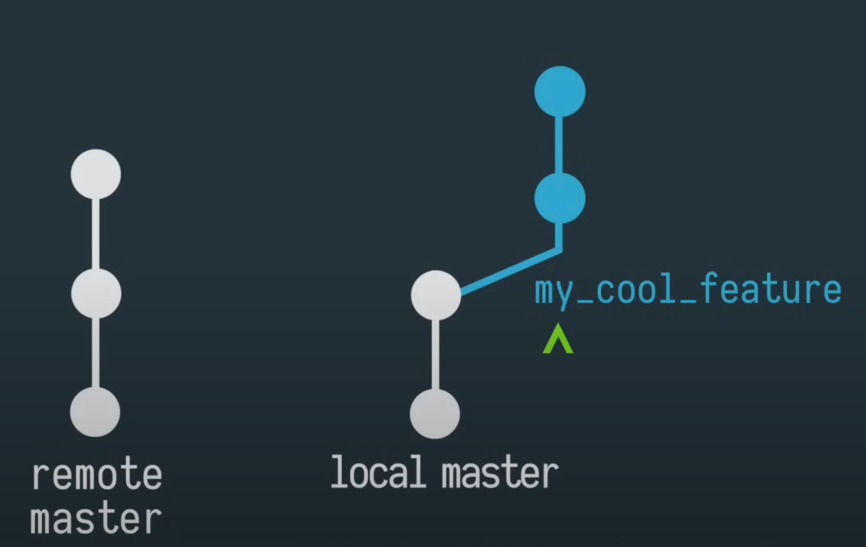
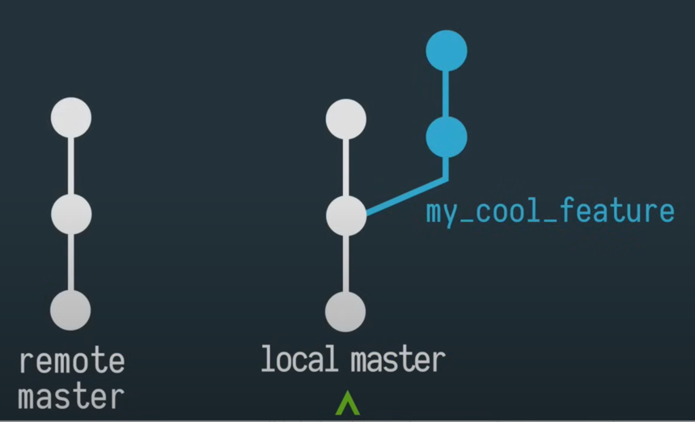
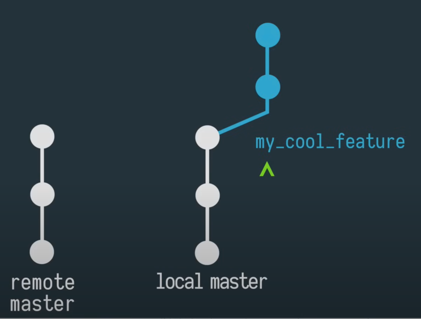
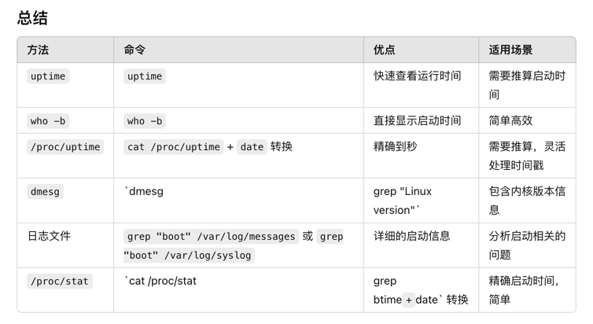

### Nov 14, 2024 TikTok

#### Course Schedule II

Follow up 如果 input 没有给 n 个 course 怎么做这道题？

**首先回顾一下 我们如何做这道题的？**

1. 首先创建 graph 通过 adjacency list 
2. 然后初始化 visited array，0 代表这个 vertex 还没有被访问， 1 代表 这个 vertex 正在被访问， 2 代表这个 vertex 已经被访问过了 
3. 之后 我们对所有的 vertex 作为起始点开始使用 dfs 遍历，并且在 遍历的过程中如果发现了 环那么直接返回 empty array，如果没有发现环那么 我们就将所有的 vertex 添加到 result list 当中去


**我们为什么需要 这个 n？**

我们需要这个 n，是因为我们需要通过这个 n 来创建一个 visited array，然后通过这个 array 来判断是否存在一个环
我们需要这个 n 作为 这个 visited array 的长度

**那么我们可以通过 找到 vertex 当中的最大值 来找到我们所需要的 n**

在我们创建 graph 的时候我们需要做出一些改变，之前我们可以通过 numVertex 直接将所有的vertex 的 adjacency list 初始化，但是当题目中没有 给 numVertex 的时候
我们就需要通过 所有的 edges 来将 adjacency list 给初始化出来

[CourseII.java](https://github.com/lizy331/Interview-kickstart/blob/main/src/main/java/InterviewByCompany/TikTok/CourseII.java)


### Nov 17, 2024 Apple

问了一些偏实际运用的问题：

#### 什么是 git rebase
想象一个场景，当你在和另一个同事在开发同一个 repo，你创建了一个新的 branch，并且在这个 branch 上做出了一些 commit，此时 你的同事已经开发完毕了
并且将他的 changes merge 到了 main branch 当中，此时 你的 local repository 当中的 main branch 就落后了，此时如果你也开发完毕了，在你merge 的时候 就会发现有冲突，我们应该怎么办？

1. 首先我们的 main branch 是落后于 目前最新的 main 的



2. 那么我们需要 在本地 checkout main branch，然后使用 git pull 将同事最新 merge 的 branch 给 download 下来



3. 然后我们 checkout 回到我们的 feature branch，然后使用 git rebase main，将我们的 新开发的 feature rebase 到最新的 main branch 上 为我们之后的 merge 作准备，**注意此时有可能出现 conflict，我们需要 resolve**



4. 最后一步我们 checkout main branch 然后将 feature branch merge

```text
git checkout main
git merge my_feature_branch
```

什么情况下使用 git pull 什么情况下 使用 git fetch？

git fetch 并不会 override 我们的本地changes, git fetch 用于检查 remote repository 的状态，看看是否有新的 changes 被merge 到了 main 当中
git pull 会 override 我们本地的 changes


#### 如何查看一个运行 linux 系统的 VM 的 start time，意思是说 这个 VM 是什么时候 开始运行的



#### 如何调取 kubernetes 当中的 node pod 以及 container 的 CPU 和 Memory？


### Nov 20, 2024 Meta

#### Search in Sorted Array

这道题面试官让我们返回最小值即可，相比于原题已经更加简单了！原题还需要让我们返回所要搜索的 target 的值, 我们可以使用 binary search 来做，首先 初始化双指针，然后 判断一下 mid 和 right 的大小，因为我们知道如果 这个 array 是没有被 rotated 的话那么
right 的数字一定是大于 mid 的数字的，那么如果 right 的数字小于 mid 的话说明 mid 到 right 这一段并不是 sorted，那么这一段数组一定是 rotated 的，所以我们应该将指针向右侧移动

如果 nums[mid] > nums[right] 说明右侧并不是 sorted，并且 mid 不可能是 最小值
left = mid + 1;

否则 nums[mid] <= nums[right] 说明右侧是 sorted，那么我们将指针向左移动，并且 mid 有可能是 最小值
right = mid;


[FindMinInRotatedSortedArray.java](src/main/java/InterviewByCompany/Meta/FindMinInRotatedArray.java)


#### sort the k segements array

```text
input:
[7,8,9,4,5,6,1,2,3]

output:
[1,2,3,4,5,6,7,8,9]
```
这道题给了一个 array 告诉我们 这个 array 会有 k 个 segments，让我们对这个 segments 进行 sort

这道题就是 merged k sorted array，但是 merge k sorted array 给我们的是一个 listNode array，但是这道题给我们的是 一个整体的 array

**解决方案1**
我们可以将这个 array 转化为 一个 listNode array 来做，之后就和 merge k sorted array 的做法一模一样，但是在转化的过程中，需要注意我们得使用两个 node array

```text
Node[] nodes
Node[] tails
```

这是因为我们如果单独使用一个 Node array node，那么我们是没办法知道在 nodes[i] 上的末尾是哪一个node，（**注意 nodes[i] 上放置的是 一个 segment的 头节点**）我们需要找到 尾节点然后将尾节点的下一个连接到当前的 node 上

**解决方案2**
我们也可以直接使用 list of list 来将所有的来自同一个 group 的 element放到同一个 list 当中，

然后同样的使用 minHeap，但是不同的是我们需要 在 minHeap 当中 的 array 里使用三个变量 也就是 

```text
int[]{value,segmentGroup, position within this segment group} 
```

在每一个 queue poll 之后判断一下 position + 1 是否小于 这个 segment group size，如果小于那么就继续添加到 minHeap 当中

[SortKSegmentsArray.java](src/main/java/InterviewByCompany/Meta/SortKSegmentsArray.java)


### Nov 21, 2024 Intuit

#### Customer Scheduler OOP

让我们设计一个 饭店处理系统，实现两个功能，我们的 customer 可能有两种一种是 regular 一种是 VIP，VIP 的优先级 要高于 regular
checkin(Customer), 
getNextCustomer() 返回下一个被 serve 的 customer

follow up 你是否可以将 VIP 处理的 ratio 设置成为 regular customer 的两倍？


