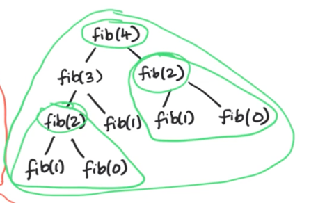
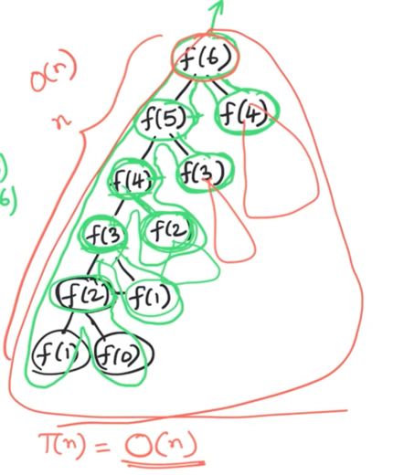
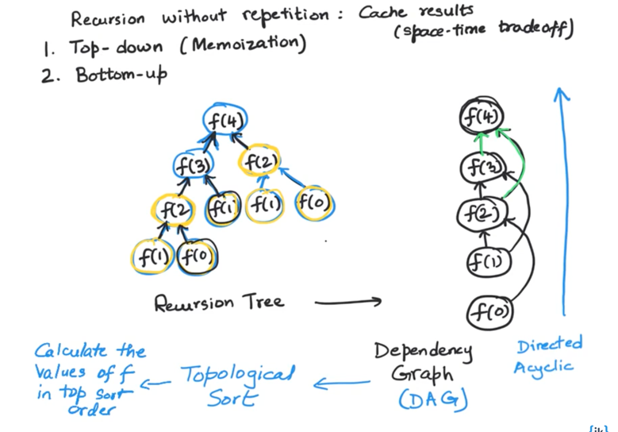
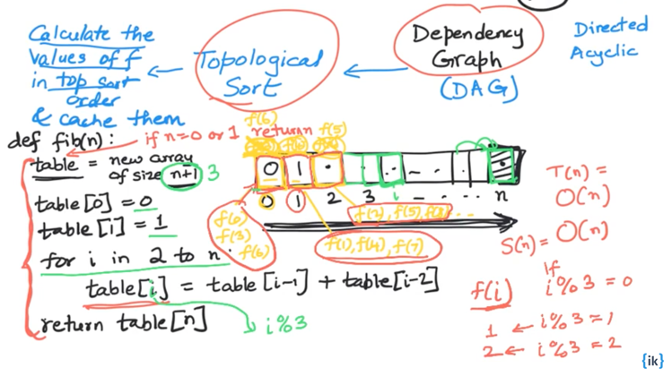
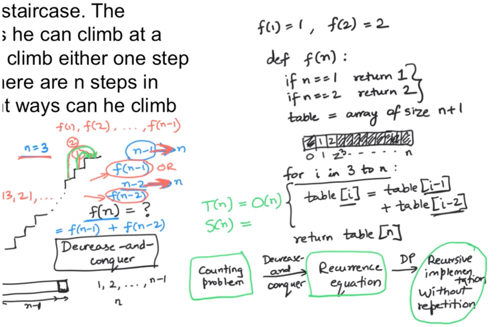
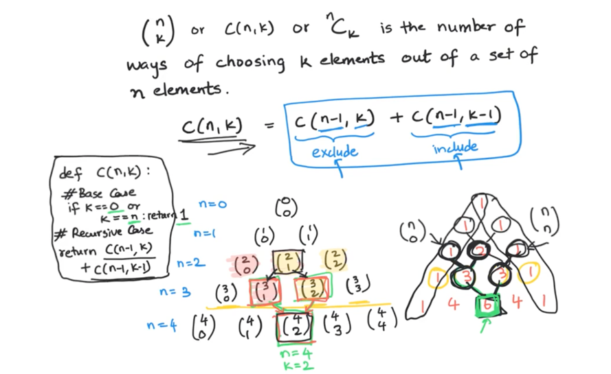
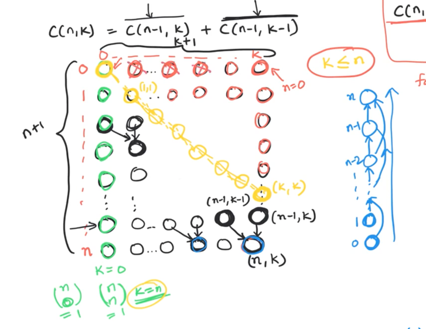
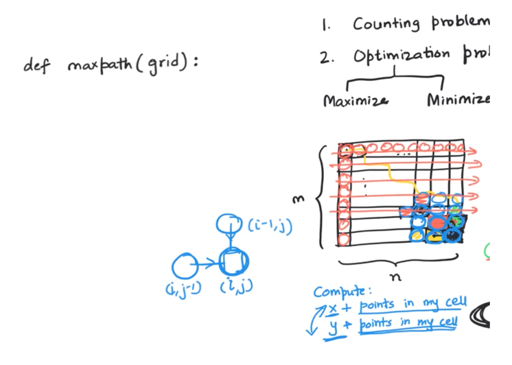
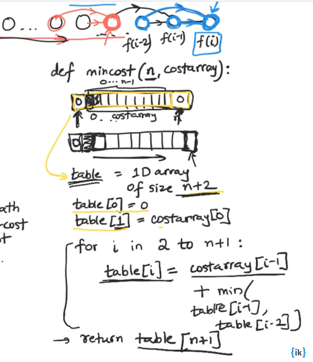
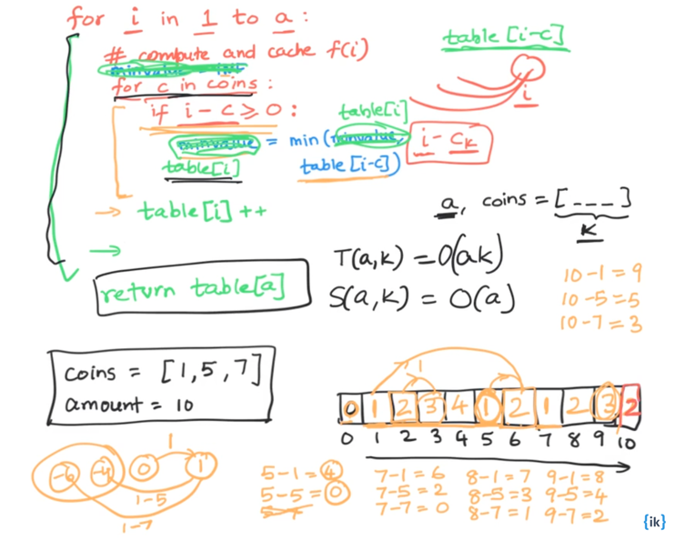

06/26

# 1. DP is just recursion without repetition

# 2. We remove the repetition work of Fibonaci array

for example fib(2) is calculated twice, if we are calculating the fib(4) by using fib(3)+fib(2)
each sub problem calculate only once


```text

                 fib(5)
              /            \
         fib(4)           fib(3)
        /       \         /      \
    fib(3)    fib(2)    fib(2)   fib(1)
/      \   /     \   /     \
fib(2) fib(1) fib(1) fib(0) fib(1)

```

```java
public class Fibonacci {
    public static int fibonacci(int n) {
        if (n <= 1) {
            return n;
        }
        return fibonacci(n - 1) + fibonacci(n - 2);
    }

    public static void main(String[] args) {
        int n = 5;
        int result = fibonacci(n);
        System.out.println("The " + n + "th Fibonacci number is: " + result);
    }
}
```


for above code, imaging the Fibonacci calculation as a tree, then the length of the tree is at least n/2 (or partial of n)
where n is the nth Fib we want to calculate,

thus the total fib() call will be the number of the nodes, which is 2^(n/2), and that **resulting an exponential time complexity.**


# 3. To Address this problem, we can memorize the previous result instead of calculateing again

```text
sudo code:

// we can use a hash table or (an array with length of n) to store the previous result

// while we calculate the result we store it into the hash table

// if the current fib is found in the hashtable, just return

```




**in this way we can bring the time down into O(n), but we add more space**


## Bottom Up Tabulation



imaging the problem as a graph, where the fib() call are the vertex, all we need to do is to do the topological sorting
and from bottom to top, we are able to figure out the answer.

we can also bring the space complexity down into a constant space, by respectively using a 3 length array



```java
class Solution{
    public static int fib(int n) {
        if (n <= 1) {
            return n;
        }

        int[] memo = new int[3];
        memo[0] = 0; // Base case for fib(0)
        memo[1] = 1; // Base case for fib(1)

        for (int i = 2; i <= n; i++) {
            memo[i % 3] = memo[(i - 1) % 3] + memo[(i - 2) % 3];
        }

        return memo[n % 3];
    }
    
}
```

Mar 15, 2024
```java
class Solution {
    
    // 思考的方式应该是先思考 array，然后 思考到 可以对 array 进行空间上的简化，也就是使用 constant space，3个 空位
    public int fib(int n) {
        if(n<2){
            return n-1==0 ? 1 : 0;
        }
        int[] arr = new int[3];
        arr[0] = 0;
        arr[1]=1;
        for(int i = 2; i <= n; i++){
            int res = arr[0] +  arr[1];
            arr[2] = res;
            arr[0] = arr[1];
            arr[1] = res;
        }

        return arr[2];
    }
}
```


# 4. Climbing n stairs

A child wants to reach the stairs n, where he can only jump 1 stair or 2 stairs each time. how many ways of the path can he reach the stairs n?



```text
 we can thing of this problem from the back, where f(n) calculates the number of ways of a child reach the stairs n
 before the child make the final move, he has two options, make a one stair jump or make a two stairs jump
 
 so that is f(n) = f(n-1) + f(n-2)
 
 because a child before reach the final stair n, he must ethier be n-1 stair or n-2 stair. thus the total ways of moving will be 
 the sum of ways of reaching those two stairs, "n-1" and "n-2".
 
```

# 5. N Choose K 

if we draw a pascal graph we can find out that C(n,k) = C(n-1,k) + C(n-1,k-1), 

for example C(4,2) = C(3,2) + C(3,1), this can be explained as from 4 we first pick one up, this one could be the one of the "2"

a. if it is not the one of the "2", then there are 3 left, and we need to choose 2 from it, the number of ways is **C(3,2)**
b. if it is the one of the "2", then there are 3 left also, but we only need to choose 1 from it, then the number of ways is **C(3,1)**

thus the total number of ways of 4 choose 2 is C(4,2) = C(3,2) + C(3,1), this explained the C(n,k) = C(n-1,k) + C(n-1,k-1)




next we can build a 2D array, where the row is the "n", the column is "k", then we can use dp to calculate the arr[n][k]




```text
sudo code:

 // set up the 2D array with row = n+1, col = r+1
 
 // init C(n,0) = (n,0) = 1, C(n,n) = (col,col) = 1
 
 // loop through each node (upper diagnal is ignored)
 // arr[i][j] = arr[i-1][j] + arr[i-1][j-1]
```

# 6. Unique Path

this question is very similar to the above

```text
sudo code:

// create a n x m array

// init all col 0 as 1, all row 0 as 1
for example n = 3, m =2 

1 1
1 0 
1 0

// arr[i][j] = arr[i-1][j] + arr[i][j-1]
```

# 7. Maximum Path Sum

similar to previous question, given a 2D matrix we need to find the maximum path sum from top left to the bottom right

where we only need to assume before last step, **the position from left and up are the maximum path sum already**, and the last step is just choose 

left or up's path are bigger, then use that path to proceed to the last position



# 8. Minimum cost stair climb

there is a note here, that we need add on two extra 0 into the cost array, this is because, there is ground and top which the cost array does not cover




# 9. Coin Change

if we have a coin arr [1,3,7], and we want to make change for 10, and we are asking how many coins at least we can make change?

we can think that from the last step, we just need to find the min coins change for 10-1=9, 10-3=7, 10-7=3, so we are looking for 

the min coin changes of 9,7,3, the final answer will be 1 add to the minimum among them



