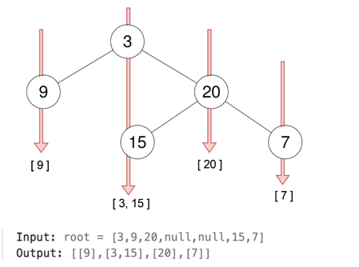

## Array:

### Leetcode 215: Kth Largest Element in an Array

考点 QuickSelect， PQ

注意在 partition 的时候 使用 4个 pointer start, a, b, end
然后再进行 recursive call 的时候注意对比 k 和 对应 阶段数组的长度

这道题顺便考差了 sort color，也就是在 使用 quickselect 的时候 我们其实就是在 进行 color sort，也就是将 数组分成三个部分 即 SSSSPPPPPLLLL

smaller then pivot, pivot, and larger than pivot

注意在我们进行 partition 的时候 ，使用 三个 pointer
pointer 用来进行对数组的遍历
sIndex 用来 swap 比 pivot 小的数字
lIndex 用来 swap 比 pivot 大的数字

使用 while loop (pointer <= lIndex) 也就是说 pointer 一旦遇见了 lIndex 那么partion 就完成了，这是因为 lIndex 之后的数字都是大于povit的

```text
while(t<=b){
         if(nums[t] < pivot){
             swap(nums,t,a);
             t++;
             a++;
         }else if(nums[t]>pivot){
             swap(nums,t,b);
             b--;
             // dont move the t, because we have not check the nums[t] value
         }else{
             // t is the pivot
             t++;
         }
     }
```

注意我们为什么不使用两遍 for loop？ 因为之后我们需要使用 sIndex 以及 lIndex 来继续进行下一轮的 quickselect, 

我们为什么使用这个 sIndex 以及 lIndex，因为假设我们的 数组当中有非常多的的 duplicated 数字，使用 sIndex 以及 lIndex 可以快速精准度定位 下一轮的 quickSelect 应该使用的 范围

### 15. 3Sum

考点：two pointer，

这道题给了一个数组，要求我们找到 三个 元素 nums[i] + nums[j] + nums[k] = 0
```text
Example 1:

Input: nums = [-1,0,1,2,-1,-4]
Output: [[-1,-1,2],[-1,0,1]]
Explanation: 
nums[0] + nums[1] + nums[2] = (-1) + 0 + 1 = 0.
nums[1] + nums[2] + nums[4] = 0 + 1 + (-1) = 0.
nums[0] + nums[3] + nums[4] = (-1) + 2 + (-1) = 0.
The distinct triplets are [-1,0,1] and [-1,-1,2].
Notice that the order of the output and the order of the triplets does not matter.
Example 2:

Input: nums = [0,1,1]
Output: []
Explanation: The only possible triplet does not sum up to 0.
Example 3:

Input: nums = [0,0,0]
Output: [[0,0,0]]
Explanation: The only possible triplet sums up to 0.
```

非常经典但是非常容易出错，有许多坑需要在面试的时候讲清楚，这道题我觉得核心要素就是你如何避免添加重复的答案, 就比如 [-1,-1,2] 和 [-1,2,-1] 实际上是一个答案

首先我们一定要 sort 这个 array，为什么？ 因为这是避免重复的第一步，因为我们可以从 最左侧开始选一个 index i 然后在 i 之后 进行 twoSum 找到其余的另外两个 index，这点为什么也是在去重，因为index i 之前的 数字已经被遍历过了，所以我们只关心 index i 之后的部分
，**然后非常关键的一步就是 在我们选择 index i 的时候 ，如果 nums[i] == nums[i+1] 那么我们需要跳过当前的 i，因为可以想像当 我们下一次 选择 index i+1 的时候一定会遇见一个重复的 triplet**

对于每一个 index i 我们进行 twoSum，来寻找 其余的 两个 index j 和 k，注意这里的 twoSum 并不是使用 binary search，而是 使用一个 sum 来判断 左指针或者右指针移动，注意左指针和右指针是 一步一步移动的
，当我们找到一个 answer 的时候 即 nums[index] + nums[j] + nums[k] == 0 的时候，此时我们将 左右指针向中间移动，但是 移动之后我们还需要做去重的工作

```java
class Solution {
    public List<List<Integer>> res;
    public List<List<Integer>> threeSum(int[] nums) {
        Arrays.sort(nums);
        res = new ArrayList<>();

        for(int i = 0;i<nums.length;i++){
            if(i == 0 || nums[i] != nums[i-1]){ // 我们需要跳过 重复的答案
                twoSum(nums,i);
            }
        }

        return res;
    }

    public void twoSum(int[] nums, int index){

        int left = index+1; // 不包括 index，因为index 就是 triplet 其中的一个答案
        int right = nums.length-1;
        

        while(left<right){
            int sum = nums[index] + nums[left] + nums[right];
            if(sum == 0){
                List<Integer> temp = new ArrayList<>();
                temp.add(nums[index]);
                temp.add(nums[left]);
                temp.add(nums[right]);
                res.add(temp);
                right--;
                left++;
                while(right>left && nums[right+1]==nums[right]){
                    right--;
                }
                while(right>left && nums[left-1]==nums[left]){
                    left++;
                }
            }else if(sum > 0){
                // dont move left pointer, because left pointer could be the min
                right--;
            }else{
                left++;
            }
        }

        return;
    }
}
```


### leetcode 238: Product of Array Except Self

考点 数组
follow up: 不使用额外数组

注意这道题目的 product 是不包含数组 nums[i] **（也就是不包含其自身的product）**

两遍遍历
可以使用一个 结果 数组 先计算 leftProduct
然后使用一个 suffix，从后往前遍历，用 suffix 来作为 rightProduct

### leetcode 53. Maximum Subarray

考点 数组 Divid and Conquer
follow up: 如何使用 divide and conquer 的方法

分治法，divide the array into three halfs,

Left -> Mid
crossArray
mid -> right

```text
L L L L L L mid R R R R R R
    i               j 
    
假设我们 i 到 j 就是 crossArray 
如何找到 i 和 j?  可以从mid 向两边遍历寻找最大sum
```


### 153. Find Minimum in Rotated Sorted Array

考点 rotated array, binary search

找最小值，如果 nums[r] < nums[mid] 说明 右侧一定被旋转过了，那么 l = mid + 1
否则 r = mid
最后返回 l


### 167. Two Sum II - Input Array Is Sorted

考点 two pointer

这道题的考点在于，对于一个 数组中寻找两数之和等于一个 target 的情况，你如何保证每一个元素只被使用了一次，
因为你使用 二分法找 num1 的 另一个 partner num2 的时候 是不应该返回 这个 num1 本身的，所以这种情况下存在binary search
 返回的还是 num1 的 index（如果 num1 + num1 = target）

所以这道题 使用 双指针从两头开始找，但是在找的过程中，可以使用 一个 二分法的思想 让 双指针走得更快一些


## _区间类问题_
56, 

### 56. Merge Intervals

考点 two pointer

设置一个 low 和 high，如果新遇见的 interval 的 lower bound 小于 之前设置的 high，那么就可以merge，否则就直接加到result list 当中
**注意 在我们循环结束之后，还需要手动的 将 low 和 high 再加一遍**

### 253. Meeting Rooms II

考点: heap,

题目描述: 给定一组会议时间区间 intervals，我们需要计算至少需要多少个会议室，才能安排所有会议。

```text
Example 1:

Input: intervals = [[0,30],[5,10],[15,20]]
Output: 2
Example 2:

Input: intervals = [[7,10],[2,4]]
Output: 1
```

我们首先将 intervals 根据 start time 排序，为什么要排序 排序的目的是 为了让所有的 会议按照 start time 来遍历，我们知道下一个 会议的 start time 一定是大于当前会议的start time 的所以我们只需要比较下一个会议的 start time 是否大于当前会议的 end time，如果大于那么说明我们不需要多余的会议室，这两个 meeting 并不相交

然后使用一个 min heap，**这个 min heap 当中放的是每一个会议的 end time**，每一个 在 heap 当中的 endTime 都代表着其占用了一个 meeting room，就如刚才所说的 如果 下一个 会议不需要使用一个新的 meeting room 那么 就可以将 heap 的 peek pop 掉

#### ChatGPT:

最小堆：使用一个最小堆（min heap）来追踪当前会议室的最早结束时间。堆顶的元素即为最早结束的会议的结束时间。

如果新会议的开始时间 >= 堆顶的结束时间，这意味着可以复用这个会议室，因此弹出堆顶。
将当前会议的结束时间加入堆中，表示占用一个会议室。

```java
class Solution {
    public int minMeetingRooms(int[][] intervals) {
        // min heap
        // top of heap is the interval with smallest start time
        // if the next meeting interval[1] <= heap.peek[1], then add the new meeting
        Arrays.sort(intervals, (a, b) -> Integer.compare(a[0], b[0]));

        PriorityQueue<Integer> heap = new PriorityQueue<>();
        heap.offer(intervals[0][1]);

        for(int i = 1;i<intervals.length;i++){
            if(intervals[i][0] >= heap.peek()){
                heap.poll();
            }
            heap.offer(intervals[i][1]);
        }

        // finally count the size of the qeuue

        return heap.size();
    }
}
```

面试官可能询问的问题

```text
1. 为什么需要按开始时间排序？
回答思路：按开始时间排序是为了确保我们能够按顺序处理会议，使得每次检查新的会议时，都能通过前一个会议的结束时间来判断是否可以复用会议室。如果不排序，就无法判断接下来的会议是否与当前会议室安排冲突。

2. 为什么选择最小堆？有其他数据结构可以替代吗？
回答思路：最小堆适合管理动态变化的结束时间。堆顶始终是最早结束的会议，因此在处理下一个会议时，可以直接判断是否可以复用这个会议室。虽然可以用数组存储所有会议的结束时间，但每次查找最小结束时间需要 O(n) 时间复杂度，而堆实现只需 O(log n)，更高效。

```

### 218. The Skyline Problem

考点: 扫描线，区间

这道题给了一个 2纬 数组，其中包含了所有建筑的 左 右 高，让我们将所有的关键点记录下来，关键点的定义是，每一个skyline 的最左边的点

这道题可以使用 扫描线来做，我们首先构建一个 map key 是 x 坐标 也就是 左 和 右点的横坐标，value 是 [height,flag] flag 的意思是用来判断这个 height 是一个building的 start 还是 end
如果 是 start flag = 1，如果是 end flag = -1，注意我们使用的应该是 tree map，因为我们到时候希望从左到右来遍历所有的 横坐标的点

接着我们需要建立一个 maxHeap，这个 maxHeap的作用是 用来维持当前 遍历到的 x 坐标上 最高的 height，因为在我们画天际线的时候如果有多个 building 重合 我们希望将最高的点画出来
然后遍历treemap，对于每一个 x 坐标，如果当前的 height flag 是 1 （也就是start of build）那么就加入到 queue 当中如果是 -1 那么就将当前的 height 从 queue 当中移除（height 一定之前被加入过）

然后此时 maxHeap 的 peek 就是我们应该加入到 result 当中的 height，但是还有一点，我们需要保证这个 x 点上的 height 和上一个 x 点的 height 是不一样的，如果和上一个 height 一样，那么说明skyline的关键点已经被画出来了， 可以一直画下去

还有一个坑就是 我们在初始化 maxHeap 的时候需要加入一个 0，作为 base line，也就是说 我们保持 maxHeap 不为空

```java
class Solution {
    public List<List<Integer>> getSkyline(int[][] buildings) {
        Map<Integer,List<int[]>> map = new TreeMap<>(); // treemap to store the: x location -> [height,start/end]

        List<List<Integer>> result = new ArrayList<>();

        for(int[] building : buildings){
            int left = building[0];
            int right = building[1];
            int height = building[2];

            map.putIfAbsent(left,new ArrayList<>());
            map.putIfAbsent(right,new ArrayList<>());

            map.get(left).add(new int[]{height,1});
            map.get(right).add(new int[]{height,-1});
        }

        Queue<Integer> maxHeap = new PriorityQueue<>((a,b) -> Integer.compare(b,a)); // maxHeap to keep track of cur x location's max height (and the heights are not end)
        int prevH = 0;
        maxHeap.offer(0);
        for(Map.Entry<Integer,List<int[]>> entry : map.entrySet()){
            int x = entry.getKey();
            List<int[]> infos = entry.getValue();
            for(int[] info : infos){
                int height = info[0];
                int flag = info[1];
                if(flag == 1){
                    maxHeap.offer(height);
                }else{
                    maxHeap.remove(height);
                }
            }

            int h = 0;
            if(!maxHeap.isEmpty()){
                h = maxHeap.peek();
                if(maxHeap.peek()!= prevH){
                    result.add(new ArrayList<>(Arrays.asList(x,h)));
                }
                prevH = h;
            }else{
                result.add(new ArrayList<>(Arrays.asList(x,h)));
            }
        }

        return result;


    }
}
```

### 128. Longest Consecutive Sequence

考点 set

注意的点，使用一个 set 检查 num-1 是否存在，如果不存在 ，说明 num 有可能是 一个连续递增 sequence 的头

注意我们在遍历的时候不要遍历数组，直接遍历 set，因为 数组当中可能存在许多 duplicate

### 31. Next Permutation

考点 array

找到下一个 比当前数组更大的 permutation
```text
find the first element start decreasing, which is 4
X X 4 7 5 3
a

then find the element just larger than 4, which is 5, 
X X 4 7 5 3
b

swap i and j
X X 5 7 4 3
a   b

then sort the part after a
```

### 75. Sort Colors

考点: array

经典的 sort color 问题

思路打开，我们可以多做几遍 loops，记住 linear time 并不是要求你 one pass，如果是 one pass 那么才是只能使用一次 for loop

### 42. Trapping Rain Water

考点 array，单调栈

解法1
使用两个数组 leftMaxHeight 以及 rightMaxHeight，leftMaxHeight 代表着从 index 0 到 index i 上出现的最高的 height，**注意这个 LeftMaxheight 或者 rightMaxHeight 是包含其自身的 height[i]的**

这是因为我们在最终计算 area 的时候使用的公式是 int area = Math.min(leftMaxHeight[i],rightMaxHeight[i]) - height[i]，也就是左右两边出现的最高的 height当中比较小的哪一个 并减去底座 也就是 height[i]

假如我们处在一个 最高的 index i 的位置上 那么这个位置上是无法收集雨水的，那么左右两边最高的就是这个 height[i]，减去这个 底座（也就是其本身）得到的 area 是 0

### 560. Subarray Sum Equals K

考点 prefixSum

这道题 让我们寻找有多少个 subarray，条件是这个 subarray 的 sum 刚好等于 k

我们可以使用 prefixSum 的思想，**并使用一个 hashmap 来记录某一个 prefixSum 出现的次数**，**每次我们计算出一个 sum，我们寻找一下 hashmap 当中是否存在 sum-k 的 prefixsum**
如果存在那么说明我们可以通过 subtract 当前 subarray 当中 sum-k的部分 来获得一个 subarray 其 sum 刚好等于 k

#### Think again:
也就是说 我们需要判断是否存在一个先前的前缀和 prefixSum[j]，满足 prefixSum[j] = prefixSum - k。如果存在，那么从 j + 1 到当前的位置 i 的子数组和即为 k。

```text
nums      [1,-1,2,3,4,5,6], k = 5
prefixSum [1,0 ,2,5,9,14,20]
```


我们发现 prefixMap 中存在 两个 prefixSum - k,
第一个是 prefixSum = 5，5-5=0，也就是说 subarray [1,-1,2,3] 是一个正确答案
第二个是 prefixSum = 14, 14-5 = 9，也就是说 subarray[1,-1,2,3,4,5] 去除 sum 等于 9 的 部分 也就是 [1,-1,2,3,4] 得到的 subarray [5] 也是一个答案

只要 map 中存在 prefixSum - k 的 prefixSum array，我们总是可以找到对应的 去除掉这部分（prefixSum-k 这部分）的 subarray 作为答案


### 739. Daily Temperatures

考点 monotonic stack

这道题，让我们寻找一个 temperature 数组当中，第 i 个 temperature 之后最近的比这个 temperature[i] 高的 temperature 的天数

我们维持一个单调递减的 monotonic stack, 每当有新的 比栈顶元素高的 temperature 出现的时候，就 pop 栈顶元素并记录天数


## Stack

### 636. Exclusive Time of Functions

考点: Stack, 边界判断

这道题 让我们模拟计算机的 function call，也就是 计算每一个 stack call 的运行时间，题目比较复杂但是题本身并不难，也就是一个 start function 一定会被一个 end function 给结束，然后让我们记录这两者之间的 时间
，难点在于，如何处理边界时间, 需要使用一个 globalTime 来记录 上一个 function call 的时间

```java
class Solution {
    public int[] exclusiveTime(int n, List<String> logs) {
        
        int[] result = new int[n];

        // [0] function id, [1] is the timestamp, pop/push based on end/start
        Deque<int[]> stack = new LinkedList<>();

        int globalTime = 0;
        for(String log : logs){
            String[] info = log.split(":");
            int id = Integer.parseInt(info[0]);
            int time = Integer.parseInt(info[2]);
            // boolean start = info[1].equals("start") ? true : false;
            if(info[1].equals("start")){
                if(!stack.isEmpty()){
                    result[stack.peek()[0]] += time - globalTime;
                }
                stack.push(new int[]{id,time});
                globalTime = time;
            }else{
                // 题目保证了 start 和 end 是相互对应的
                int[] startCall = stack.poll();
                result[startCall[0]] += time - globalTime + 1;
                globalTime = time+1;
            }
        }


        return result;
    }
}
```


## String

### 49. Group Anagrams

考点: hashmap

注意在当hashmap 中没有储存过 key 的时候，我们添加这个 key 和 ArrayList 的pair，**并且要将当前的 string 加入到这个 arraylist 当中**


### 5. Longest Palindromic Substring

考点: two pointer

主要的核心在于 处理回文长度的起点 是奇数还是偶数的情况 

aba 是 从一个 character 'b' 开始向两边衍生的，

abba 是从两个 character 'bb' 开始向两遍衍生的，这是需要通过 观察以及经验 总结出来的


### 3. Longest Substring Without Repeating Characters

考点: hashmap, sliding window

这道题，需要注意我们维持一个 sliding window，每一次我们遍历到一个新的 character，检查一下这个 char 是否出现在 hashmap 当中

如果出现了，那么我们需要判断这个repeat char 是出现在 当前维持的 sliding window (left -> right) 之间还是在 left 之前

如果 这个 repeat char 出现在 left 之前那么 当前的 sliding window 就是 valid，如果 出现在 当前的 left 之后，那么我们需要更新当前的 left pointer 然后计算 当前 sliding window
 的 length


### 20. Valid Parentheses

考点: 括号类字符, Stack

注意当栈为空的时候以及 当前遍历的 char 是 左括号时 stack.push


### 76. Minimum Window Substring

考点: sliding window

这道题最主要的是使用两个 hashmap 来 记录 两个 string 的 frequency

一个 是 target word 的 character frequency, freqT
另一个是用来记录 sliding window 当中的 character frequency

我们需要使用一个 formed 数字用来记录当前 window 当中有多少 character 满足了 target word frequency，如果 formed = freqT.size() 那么说明当前 windwo 满足了包括所有 target word 当中的 character 以及 frequency 的条件

此时我们就开始 shrinking 我们的 window
，因为题目要求我们找到最小的 window，在shrink 的同时也需要对window 的 frequency map 进行修改


### 1249. Minimum Remove to Make Valid Parentheses

考点: 括号类 

使用 stack 的时候 需要表达清楚 stack 当中储存的是什么，这档题当中 stack 储存 左括号的的 index


### 165. Compare Version Numbers

考点: 正则表达，从 String 当中提取数字

这道题让我们对两个 string version 进行比较，version 的内容只包含 数字 和 "."

```text
Example 1:

Input: version1 = "1.2", version2 = "1.10"

Output: -1

Explanation:

version1's second revision is "2" and version2's second revision is "10": 2 < 10, so version1 < version2.

Example 2:

Input: version1 = "1.01", version2 = "1.001"

Output: 0

Explanation:

Ignoring leading zeroes, both "01" and "001" represent the same integer "1".

Example 3:

Input: version1 = "1.0", version2 = "1.0.0.0"

Output: 0

Explanation:

version1 has less revisions, which means every missing revision are treated as "0".
```

这道题 最关键的 想法是需要对 version string 进行 dot 也就是"." 进行 split，并且在 Java 当中 **String.split() 这个 function 输入的是一个正则表达式，而 "." 是正则表达的一个特殊符号，所以我们必须将其写成 "\\." 也就是使用两个 back slash，这是这个题目的一个坑**

在我们 split 了 string 之后，那么就按照split之后的 String 数组进行遍历就可以了，在每一个 index 位置上对 String 进行 parse int，然后进行比较

```java
class Solution {
    public int compareVersion(String version1, String version2) {
        String[] s1 = version1.split("\\.");
        String[] s2 = version2.split("\\.");

        // System.out.println(Arrays.toString(s1));

        int maxLength = Math.max(s1.length,s2.length);

        for(int i = 0;i<maxLength;i++){
            int v1 = i<s1.length ? Integer.parseInt(s1[i]) : 0;
            int v2 = i<s2.length ? Integer.parseInt(s2[i]) : 0;
            if(v1 > v2){
                return 1;
            }else if (v1<v2){
                return -1;
            }

        }

        return 0;

    }
}
```


### 528. Random Pick with Weight

考点: Binary Search

使用 prefixSum，生成一个 prefixSum 数值范围内的 random number，然后使用 binary search
 在 prefixSum 当中寻找插入点


### 162. Find Peak Element

考点: Binary Search

对比 nums[mid] 和 nums[mid+1] 的值，**如果 mid 大于 mid+1 的值 说明 peak 一定存在 mid 之前（有可能就是 mid），如果 mid小于 mid + 1，那么说明 peak 一定在 mid 之后**

```text
            *
          @
            *
#                     #
```
假设 @ 是我们的 mid，

那么对比一下 mid + 1，如果 mid + 1 大于 mid，（上边的星）那么 peak一定在 mid 之后，移动左指针 left = mid + 1

如果 mid + 1 小于 mid（下边的星）那么peak 一定在 mid 之前，有可能就是 mid, 所以我们应该移动右指针 right = mid，（**不是 mid - 1，因为 mid 也有可能就是答案**）


### 1004. Max Consecutive Ones III

考点: two pointer, sliding window

给了一个数组和一个 k ，让我们寻找数组中最长的连续的 1（数组只包含 0 或者 1），并且规定我们可以最多 flip k 个 0 成为 1

那么就思考 sliding window
，一旦 right pointer 为 0，并且 flipped 的数量超过或等于了 k，也就是说 对于此时这个 nums[right] = 0 我们不能再使用 flip 将其变成 1了，

那么只能通过 移动左指针来找到一个 0，并且将左指针跨过这个 0，这样才可以找补回来当前 right pointer 遇见的 0，

**下面的代码是我自己写的，比较好理解**

```java
class Solution {
    public int longestOnes(int[] nums, int k) {
        

        // 1,1,1,0,0,0,1,1,1,1,0
                //    l
                //      r
        // sliding window, maintain a number called fliped
        
        int left = 0;
        int right = 0;
        int result = 0;
        int fliped = 0;

        while(right<nums.length){
            if(nums[right] == 1){
                result = Math.max(right-left+1,result);
                // right++;
            }else{
                if(fliped>=k){
                    // move the left pointer
                    while(left<right && nums[left]==1){
                        left++;
                    }
                    // fliped--;
                    left++;
                    // right++;
                }else{
                    // still can flip
                    result = Math.max(right-left+1,result);
                    fliped++;
                    // right++;
                }
            }
            right++;
        }

        return result;
    }
}
```


### 670. Maximum Swap

考点: array

```text
Example 1:

Input: num = 2736
Output: 7236
Explanation: Swap the number 2 and the number 7.
Example 2:

Input: num = 9973
Output: 9973
Explanation: No swap.
```

这道题 让我们对一个数字进行一次 swap，使得这个 数字的数值最大，正常的想法就是找到哪一个位置我们需要进行 swap，然后从右往左进行遍历找到一个最大的数字，然后和这个数字进行 swap

如果有多个最大数字 9，那么我们交换的时候显然是希望将 越往数组后边的 数字越好，因为这样交换出来的数字就越大


## LinkedList

### 23. Merge k Sorted Lists

考点: Linkedlist heap

这道题让我们对一个 listNode array 进行合并，并且告诉我们每一个 linkedlist 都是 ASC sorted

我们可以使用 一个 heap 用来储存 每一个 linkedlist 的 node, 然后每一次将 heap 当中的最小的 node 提出来 construct 新的 node
，我们需要使用 Pair， heap 当中储存的 是 Pair<Integer,ListNode>，也就是 lists 的 index 以及 ListNode

在我们构建 priorityQueue 的时候 需要注意使用正确的 lambda function

```text
// 1 4 5
// 1 3 4
// 2 6
// heap, put the index and listNode value
```

```java
/**
 * Definition for singly-linked list.
 * public class ListNode {
 *     int val;
 *     ListNode next;
 *     ListNode() {}
 *     ListNode(int val) { this.val = val; }
 *     ListNode(int val, ListNode next) { this.val = val; this.next = next; }
 * }
 */
class Solution {
    public ListNode mergeKLists(ListNode[] lists) {
        if(lists.length==0){return null;}
        
        // 1 4 5
        // 1 3 4
        // 2 6
        // heap, put the index and listNode value

        PriorityQueue<Pair<Integer,ListNode>> heap = new PriorityQueue<>((Pair<Integer,ListNode> a, Pair<Integer,ListNode> b) -> Integer.compare(a.getValue().val,b.getValue().val));


        // put all the listnode head value into heap
        for(int i = 0;i<lists.length;i++){
            // 需要检查 每一个 lists 的头节点是否为空
            if(lists[i]!=null){
                heap.add(new Pair<>(i,lists[i]));
            }
        }

        // while heap is not empty, keep rotate the lisinode, untill it reach null
        ListNode dummy = new ListNode(-1);
        ListNode pointer = dummy;

        while(!heap.isEmpty()){
            Pair<Integer,ListNode> pair = heap.poll();
            int index = pair.getKey();
            ListNode node = pair.getValue();

            pointer.next = node;
            pointer = pointer.next;
            
            if(node.next != null){
                heap.offer(new Pair<>(index,node.next));
            } 
        }

        return dummy.next;

    }
}
```


## Tree

### 314. Binary Tree Vertical Order Traversal

考点: BFS 

这道题让我们将处在同一个水平线上的 treenode value 统一的收集起来，注意在返回的时候，我们需要按照从左到右的顺序返回这些在一个水平线上的 values

使用一个 treeMap（treemap 用来对 水平线坐标排序） 以及queue，queue中储存的 是 TreeNode 和 location 的 pair




### 236. Lowest Common Ancestor of a Binary Tree

考点: DFS 


### 199. Binary Tree Right Side View

考点: DFS BFS

这道题返回 一个 binary tree 的 右边的 视角，并且从上到下的返回 node value

BFS 很直接，在每一层的最后一个 位置添加 node value 到 result list 当中即可

DFS 比较麻烦，我第一次做的时候，觉得只要让 node 一直往右子树走就可以，但是这种想法是错的，因为如果在某一层上 node 的右子树为 null，那么此时 right side view 看到的其实是 左子树的 node
所以我们对于每一个 node 还是得 左右子树都遍历，但是在添加的时候使用一些技巧

```text
         1
      2     3
   4    5 6    7
   
```
对于上面这个 树，right side view 是 1 3 7，我们使用 DFS 的时候 可以使用一个 depth，我们可以发现 树的深度就是最终 result list 的 size

所以我们可以对比一下 如果 depth = 0 的时候 result 也等于 0，那么 此时我们就将 当前的 node value 加入到 result list 当中，

为什么？因为我们是从上到下的 （这种方法是 top down approach）所以当前遇见的 node 一定是这个 depth 第一次遇见的 node，如果之前已经有 node 被添加在了 result list 当中
那么 result list 的 size 一定会 大于 depth

```java
class Solution {
  public List<Integer> result;
  public List<Integer> rightSideView(TreeNode root) {
   result = new ArrayList<>();
   if(root == null){return result;}
 
   dfs(root,0);
 
   return result;
  }
 
  public void dfs(TreeNode node, int depth){
   if(node == null){return;}
 
   if(depth==result.size()){
    result.add(node.val);
   }
 
   dfs(node.right,depth+1);
   dfs(node.left,depth+1);
 
   return;
  }
}
```


### 426. Convert Binary Search Tree to Sorted Doubly Linked List

考点: DFS, path

在做 tree 一类的 问题的时候，**我们可以使用一个 全局变量 叫做 lastNode 来记录 当前 node 的 parent node 是什么**，这是一个非常重要的 技巧


### 129. Sum Root to Leaf Numbers

考点: DFS BFS

这道题让我们计算从 root 到 leaf 所组成的数字的和，也就是 一条树枝上 1->2->3->4 所组成的数字 就是 1234，我们需要将所有这样的数字加到 result 当中

我们可以使用 DFS，使用的 是 top down approach，dfs method 使用一个 carry 来记录来自上一层的 carry，每当进入 node，首先计算 carry, 然后非常重要的是 我**们需要在 node.left == null && node.right==null 的时候 才将 carry 加入到 result 当中**
否则，我们得到的结果会是 2倍的 actual result，这是因为如果我们在 node==null 的时候 将 carry 加入到 result 那么 这个 node == null 可以来自左子树也可以来自右子树，所以我们会将结果计算两遍

也可以使用 BFS，使用 BFS 的时候 我们需要注意使用 Pair，来记录 Treenode 以及 来自上一层的 carry

## Graph

### 133. Clone Graph

考点: DFS BFS
这道题给了一个 graph node （undirected），通过 Adjacent list 的方式储存，让我们实现 deep copy，

这道题的核心就在于 使用一个 hashmap ，key 作为 original node，value 作为 copy node，

BFS 的做法，我们需要提前在 hashmap 当中构建 node -> copy node 的映射，然后在每一层遍历的时候首先检查这个 neighbor 是否存在 hashmap 当中，如果不存在，则添加

DFS 的做法，需要注意的是我们需要使用 hashmap 来防止重复的 访问 某一个 node，也就是说 DFS 的停止条件是 

```text
if(map.contains(node)){return;}

```