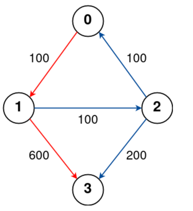

## Array:

### Leetcode 215: Kth Largest Element in an Array

考点 QuickSelect， PQ

注意在 partition 的时候 使用 4个 pointer start, a, b, end
然后再进行 recursive call 的时候注意对比 k 和 对应 阶段数组的长度

这道题顺便考差了 sort color，也就是在 使用 quickselect 的时候 我们其实就是在 进行 color sort，也就是将 数组分成三个部分 即 SSSSPPPPPLLLL

smaller then pivot, pivot, and larger than pivot

注意在我们进行 partition 的时候 ，使用 三个 pointer
pointer 用来进行对数组的遍历
sIndex 用来 swap 比 pivot 小的数字
lIndex 用来 swap 比 pivot 大的数字

使用 while loop (pointer <= lIndex) 也就是说 pointer 一旦遇见了 lIndex 那么partion 就完成了，这是因为 lIndex 之后的数字都是大于povit的

```text
while(t<=b){
         if(nums[t] < pivot){
             swap(nums,t,a);
             t++;
             a++;
         }else if(nums[t]>pivot){
             swap(nums,t,b);
             b--;
             // dont move the t, because we have not check the nums[t] value
         }else{
             // t is the pivot
             t++;
         }
     }
```

注意我们为什么不使用两遍 for loop？ 因为之后我们需要使用 sIndex 以及 lIndex 来继续进行下一轮的 quickselect, 

我们为什么使用这个 sIndex 以及 lIndex，因为假设我们的 数组当中有非常多的的 duplicated 数字，使用 sIndex 以及 lIndex 可以快速精准度定位 下一轮的 quickSelect 应该使用的 范围

### 15. 3Sum

考点：two pointer，

这道题给了一个数组，要求我们找到 三个 元素 nums[i] + nums[j] + nums[k] = 0
```text
Example 1:

Input: nums = [-1,0,1,2,-1,-4]
Output: [[-1,-1,2],[-1,0,1]]
Explanation: 
nums[0] + nums[1] + nums[2] = (-1) + 0 + 1 = 0.
nums[1] + nums[2] + nums[4] = 0 + 1 + (-1) = 0.
nums[0] + nums[3] + nums[4] = (-1) + 2 + (-1) = 0.
The distinct triplets are [-1,0,1] and [-1,-1,2].
Notice that the order of the output and the order of the triplets does not matter.
Example 2:

Input: nums = [0,1,1]
Output: []
Explanation: The only possible triplet does not sum up to 0.
Example 3:

Input: nums = [0,0,0]
Output: [[0,0,0]]
Explanation: The only possible triplet sums up to 0.
```

非常经典但是非常容易出错，有许多坑需要在面试的时候讲清楚，这道题我觉得核心要素就是你如何避免添加重复的答案, 就比如 [-1,-1,2] 和 [-1,2,-1] 实际上是一个答案

首先我们一定要 sort 这个 array，为什么？ 因为这是避免重复的第一步，因为我们可以从 最左侧开始选一个 index i 然后在 i 之后 进行 twoSum 找到其余的另外两个 index，这点为什么也是在去重，因为index i 之前的 数字已经被遍历过了，所以我们只关心 index i 之后的部分
，**然后非常关键的一步就是 在我们选择 index i 的时候 ，如果 nums[i] == nums[i+1] 那么我们需要跳过当前的 i，因为可以想像当 我们下一次 选择 index i+1 的时候一定会遇见一个重复的 triplet**

对于每一个 index i 我们进行 twoSum，来寻找 其余的 两个 index j 和 k，注意这里的 twoSum 并不是使用 binary search，而是 使用一个 sum 来判断 左指针或者右指针移动，注意左指针和右指针是 一步一步移动的
，当我们找到一个 answer 的时候 即 nums[index] + nums[j] + nums[k] == 0 的时候，此时我们将 左右指针向中间移动，但是 移动之后我们还需要做去重的工作

```java
class Solution {
    public List<List<Integer>> res;
    public List<List<Integer>> threeSum(int[] nums) {
        Arrays.sort(nums);
        res = new ArrayList<>();

        for(int i = 0;i<nums.length;i++){
            if(i == 0 || nums[i] != nums[i-1]){ // 我们需要跳过 重复的答案
                twoSum(nums,i);
            }
        }

        return res;
    }

    public void twoSum(int[] nums, int index){

        int left = index+1; // 不包括 index，因为index 就是 triplet 其中的一个答案
        int right = nums.length-1;
        

        while(left<right){
            int sum = nums[index] + nums[left] + nums[right];
            if(sum == 0){
                List<Integer> temp = new ArrayList<>();
                temp.add(nums[index]);
                temp.add(nums[left]);
                temp.add(nums[right]);
                res.add(temp);
                right--;
                left++;
                while(right>left && nums[right+1]==nums[right]){
                    right--;
                }
                while(right>left && nums[left-1]==nums[left]){
                    left++;
                }
            }else if(sum > 0){
                // dont move left pointer, because left pointer could be the min
                right--;
            }else{
                left++;
            }
        }

        return;
    }
}
```


### 16. 3Sum Closest

考点: two pointer

这道题是 3sum 的变种，现在告诉我们，array 中可能不存在 target，让我们寻找 3sum 得到的最接近 target 的结果，还是和 3sum 一样的做法，在 two sum 当中我们需要在每次移动两个指针的时候判断一下 当前的sum 和 target 的距离，并使用一个 global result 来记录距离 target 最近的 result

我第一次的做的时候出现的错误，
1. 既然是距离，那么你就需要使用 Math.abs() 来做，
2. 在初始化 result 的时候，应该将 result 初始化为 nums[i], nums[j], nums[k]
3. for loop 的时候，i 应该在 i<nums.length-2 时停止

```java
class Solution {
    public int threeSumClosest(int[] nums, int target) {
        //sort the array
        Arrays.sort(nums);

        // for every i, find the j and k that closest to target, if equal to tagrte then return
        int result = nums[0] + nums[1] + nums[2];
        for(int i = 0;i<nums.length-2;i++){
            int temp = twoSum(nums,i,target);
            if(temp == target){
                return temp;
            }else{
                result = Math.abs(result-target) >= Math.abs(temp-target) ? temp : result;
            }
        }

        return result;

    }

    public int twoSum(int[] nums, int i, int target){
        int j = i+1;
        int k = nums.length-1;
        int sum = 0;
        int result = nums[i] + nums[j] + nums[k];
        while(j<k){
            sum = nums[i] + nums[j] + nums[k];
            if(sum == target){
                return sum;
            }else if(sum < target){
                result = Math.abs(result - target) >= Math.abs(sum - target) ? sum : result;
                j++;
            }else{
                result = Math.abs(result - target) > Math.abs(sum - target) ? sum : result;
                k--;
            }
        }

        return result;
    }
}
```

时间复杂度 O(nlogn)
空间复杂度 O(1)


### 18. 4Sum

考点: two pointer

```text
Example 1:

Input: nums = [1,0,-1,0,-2,2], target = 0
Output: [[-2,-1,1,2],[-2,0,0,2],[-1,0,0,1]]
Example 2:

Input: nums = [2,2,2,2,2], target = 8
Output: [[2,2,2,2]]
```
4Sum 同样是按照 3 sum 的方法来做，先选一个 a，然后开始循环 b，选一个 b，开始循环 c 和 d，特别需要注意中间的去重

这道题给我的启发是，我们不需要特别的写一个单独的function，来做 twoSum，我们可以直接将所有的嵌套写在一个function 当中，我们在写 3sum 的时候也应该这么做，因为快

```java
class Solution {
    public List<List<Integer>> fourSum(int[] nums, int target) {
        Arrays.sort(nums);
        List<List<Integer>> result = new ArrayList<>();
        
        for (int a = 0; a < nums.length - 3; a++) {
            if (a > 0 && nums[a] == nums[a - 1]) continue;  // 去重
            
            for (int b = a + 1; b < nums.length - 2; b++) {
                if (b > a + 1 && nums[b] == nums[b - 1]) continue;  // 去重
                
                int c = b + 1;
                int d = nums.length - 1;
                
                while (c < d) {
                    int sum = nums[a] + nums[b] + nums[c] + nums[d];
                    
                    if (sum == target) {
                        result.add(Arrays.asList(nums[a], nums[b], nums[c], nums[d]));
                        
                        while (c < d && nums[c] == nums[c + 1]) c++;  // 去重
                        while (c < d && nums[d] == nums[d - 1]) d--;  // 去重
                        
                        c++;
                        d--;
                    } else if (sum < target) {
                        c++;
                    } else {
                        d--;
                    }
                }
            }
        }
        
        return result;
    }
}

```

时间复杂度 O(N^3)
空间 O(n); 用于保存结果

### 259. 3Sum Smaller

考点: two pointer

和之前的 3sum 非常类似，不同点在于 现在 我们需要统计的是 3sum 小于 target 的数量，并且我们是允许 duplicate 的

```java
class Solution {
    public int threeSumSmaller(int[] nums, int target) {
        if(nums.length<3){return 0;}

        Arrays.sort(nums);
        int result = 0;
        for(int i = 0;i<nums.length-1;i++){
            int j = i+1;
            int k = nums.length-1;
            while(j<k){
                int sum = nums[i] + nums[j] + nums[k];
                if(sum < target){
                    result += k-j; // 注意计数的方式 i j       k, 如果 目前的 i j k 满足小于 target的条件，那么 i j k-1 也满足，i j k-2 也满足 。。。，所以共有 k-j 个答案，
                    j++;
                }else{
                    k--;
                }
            }
        }

        return result;
    }
}
```

时间 O(nlogn)
空间 O(1)

注意 k-j+1 是 index j 到 k 所有元素的个数
k-j 则是去除了一个元素，在这道题中，我们计数结果的时候，不能把 j 算进去，因为 k 不能移动到 j 的位置上

### 30. Substring with Concatenation of All Words

考点: Two pointer

这道题给了一个 words array 其中包含 string，然后给了我们一个 string s, 让我们寻找哪些 startIndex 是一个恰好（exactly）包含所有的 在 words 当中的 string


```text
Example 1:

Input: s = "barfoothefoobarman", words = ["foo","bar"]

Output: [0,9]

Explanation:

The substring starting at 0 is "barfoo". It is the concatenation of ["bar","foo"] which is a permutation of words.
The substring starting at 9 is "foobar". It is the concatenation of ["foo","bar"] which is a permutation of words.

Example 2:

Input: s = "wordgoodgoodgoodbestword", words = ["word","good","best","word"]

Output: []

Explanation:

There is no concatenated substring.

Example 3:

Input: s = "barfoofoobarthefoobarman", words = ["bar","foo","the"]

Output: [6,9,12]

Explanation:

The substring starting at 6 is "foobarthe". It is the concatenation of ["foo","bar","the"].
The substring starting at 9 is "barthefoo". It is the concatenation of ["bar","the","foo"].
The substring starting at 12 is "thefoobar". It is the concatenation of ["the","foo","bar"].
```

sliding window

```java
import java.util.*;

class Solution {
    public List<Integer> findSubstring(String s, String[] words) {
        List<Integer> result = new ArrayList<>();
        if (s == null || s.length() == 0 || words == null || words.length == 0) return result;

        int wordLength = words[0].length();
        int wordCount = words.length;
        int windowSize = wordLength * wordCount;

        Map<String, Integer> wordFreq = new HashMap<>();
        for (String word : words) {
            wordFreq.put(word, wordFreq.getOrDefault(word, 0) + 1);
        }

        for (int start = 0; start < wordLength; start++) {
            Map<String, Integer> windowMap = new HashMap<>();
            int left = start, count = 0;

            for (int right = start; right <= s.length() - wordLength; right += wordLength) { // 需要学习这种 移动指针的方式，尤其是我们需要按照一个递增或递减的的 fixed 数量来遍历
                String sub = s.substring(right, right + wordLength);

                if (wordFreq.containsKey(sub)) {
                    windowMap.put(sub, windowMap.getOrDefault(sub, 0) + 1);
                    count++;

                    while (windowMap.get(sub) > wordFreq.get(sub)) {
                        String leftWord = s.substring(left, left + wordLength);
                        windowMap.put(leftWord, windowMap.get(leftWord) - 1);
                        left += wordLength;
                        count--;
                    }

                    if (count == wordCount) {
                        result.add(left);
                    }
                } else {
                    windowMap.clear();
                    count = 0;
                    left = right + wordLength;
                }
            }
        }
        return result;
    }
}

```
### leetcode 238: Product of Array Except Self

考点 数组
follow up: 不使用额外数组

注意这道题目的 product 是不包含数组 nums[i] **（也就是不包含其自身的product）**

两遍遍历
可以使用一个 结果 数组 先计算 leftProduct
然后使用一个 suffix，从后往前遍历，用 suffix 来作为 rightProduct

### leetcode 53. Maximum Subarray

考点 数组 Divid and Conquer
follow up: 如何使用 divide and conquer 的方法

分治法，divide the array into three halfs,

Left -> Mid
crossArray
mid -> right

```text
L L L L L L mid R R R R R R
    i               j 
    
假设我们 i 到 j 就是 crossArray 
如何找到 i 和 j?  可以从mid 向两边遍历寻找最大sum
```


### 153. Find Minimum in Rotated Sorted Array

考点 rotated array, binary search

找最小值，如果 nums[r] < nums[mid] 说明 右侧一定被旋转过了，那么 l = mid + 1
否则 r = mid
最后返回 l


### 167. Two Sum II - Input Array Is Sorted

考点 two pointer

这道题的考点在于，对于一个 数组中寻找两数之和等于一个 target 的情况，你如何保证每一个元素只被使用了一次，
因为你使用 二分法找 num1 的 另一个 partner num2 的时候 是不应该返回 这个 num1 本身的，所以这种情况下存在binary search
 返回的还是 num1 的 index（如果 num1 + num1 = target）

所以这道题 使用 双指针从两头开始找，但是在找的过程中，可以使用 一个 二分法的思想 让 双指针走得更快一些


### 665. Non-decreasing Array

考点: sort, Array

这道题 要求我们在 只能替换一个数字的情况下，判断这个 array 是否是 non decreasing 的

```text
Example 1:

Input: nums = [4,2,3]
Output: true
Explanation: You could modify the first 4 to 1 to get a non-decreasing array.
Example 2:

Input: nums = [4,2,1]
Output: false
Explanation: You cannot get a non-decreasing array by modifying at most one element.
```

这道题的核心在于 当我们遇见第一次 nums[i-1] >= nums[i] 的时候如何使用我们的 替换权利 来将 nums[i-1] 或者是 nums[i] 替换
比如说 5 6 4 9 12 当我们遍历到 4 的时候，我们需要考虑 是将 4 变成 6 还是 将 6 变成 4，显然我们需要将 4 变成 6，否则数组将不再递增

所以我们在 判断的时候 还需要考虑 nums[i-2] 这个 数字

```text
if nums[i-2] > nums[i]          //说明 nums[i] 太小了
    nums[i] = nums[i-1]
else if nums[i-2] <= nums[i]    // 注意这里为什么是 <=,  如果 nums[i-2] 和 nums[i] 相等了，那么我们应该替换的是 nums[i-1]，因为此时 nums[i-1] 是 大于 nums[i] 的
    nums[i-1] = nums[i] 
```

还有 我们使用了 i-2 这样的 index，所以需要小心数组越界的情况

```java
class Solution {
    public boolean checkPossibility(int[] nums) {
        

        // 3 6 4 3
        int count = 0;
        for(int i = 1;i<nums.length;i++){
            if(nums[i] < nums[i-1]){
                count++;
                if(count > 1){
                    return false;
                }

                if(i<2 || nums[i-2] <= nums[i]){ // 为什么这里是 <= ?
                    nums[i-1] = nums[i];
                    
                }else{
                    // nums[i] is too small
                    nums[i] = nums[i-1];
                }
            }
        }

        return true;
    }
}
```


## _区间类问题_
56, 

### 56. Merge Intervals

考点 two pointer

设置一个 low 和 high，如果新遇见的 interval 的 lower bound 小于 之前设置的 high，那么就可以merge，否则就直接加到result list 当中
**注意 在我们循环结束之后，还需要手动的 将 low 和 high 再加一遍**

### 253. Meeting Rooms II

考点: heap,

题目描述: 给定一组会议时间区间 intervals，我们需要计算至少需要多少个会议室，才能安排所有会议。

```text
Example 1:

Input: intervals = [[0,30],[5,10],[15,20]]
Output: 2
Example 2:

Input: intervals = [[7,10],[2,4]]
Output: 1
```

我们首先将 intervals 根据 start time 排序，为什么要排序 排序的目的是 为了让所有的 会议按照 start time 来遍历，我们知道下一个 会议的 start time 一定是大于当前会议的start time 的所以我们只需要比较下一个会议的 start time 是否大于当前会议的 end time，如果大于那么说明我们不需要多余的会议室，这两个 meeting 并不相交

然后使用一个 min heap，**这个 min heap 当中放的是每一个会议的 end time**，每一个 在 heap 当中的 endTime 都代表着其占用了一个 meeting room，就如刚才所说的 如果 下一个 会议不需要使用一个新的 meeting room 那么 就可以将 heap 的 peek pop 掉

#### ChatGPT:

最小堆：使用一个最小堆（min heap）来追踪当前会议室的最早结束时间。堆顶的元素即为最早结束的会议的结束时间。

如果新会议的开始时间 >= 堆顶的结束时间，这意味着可以复用这个会议室，因此弹出堆顶。
将当前会议的结束时间加入堆中，表示占用一个会议室。

```java
class Solution {
    public int minMeetingRooms(int[][] intervals) {
        // min heap
        // top of heap is the interval with smallest start time
        // if the next meeting interval[1] <= heap.peek[1], then add the new meeting
        Arrays.sort(intervals, (a, b) -> Integer.compare(a[0], b[0]));

        PriorityQueue<Integer> heap = new PriorityQueue<>();
        heap.offer(intervals[0][1]);

        for(int i = 1;i<intervals.length;i++){
            if(intervals[i][0] >= heap.peek()){
                heap.poll();
            }
            heap.offer(intervals[i][1]);
        }

        // finally count the size of the qeuue

        return heap.size();
    }
}
```

面试官可能询问的问题

```text
1. 为什么需要按开始时间排序？
回答思路：按开始时间排序是为了确保我们能够按顺序处理会议，使得每次检查新的会议时，都能通过前一个会议的结束时间来判断是否可以复用会议室。如果不排序，就无法判断接下来的会议是否与当前会议室安排冲突。

2. 为什么选择最小堆？有其他数据结构可以替代吗？
回答思路：最小堆适合管理动态变化的结束时间。堆顶始终是最早结束的会议，因此在处理下一个会议时，可以直接判断是否可以复用这个会议室。虽然可以用数组存储所有会议的结束时间，但每次查找最小结束时间需要 O(n) 时间复杂度，而堆实现只需 O(log n)，更高效。

```

### 218. The Skyline Problem

考点: 扫描线，区间

这道题给了一个 2纬 数组，其中包含了所有建筑的 左 右 高，让我们将所有的关键点记录下来，关键点的定义是，每一个skyline 的最左边的点

这道题可以使用 扫描线来做，我们首先构建一个 map key 是 x 坐标 也就是 左 和 右点的横坐标，value 是 [height,flag] flag 的意思是用来判断这个 height 是一个building的 start 还是 end
如果 是 start flag = 1，如果是 end flag = -1，注意我们使用的应该是 tree map，因为我们到时候希望从左到右来遍历所有的 横坐标的点

接着我们需要建立一个 maxHeap，这个 maxHeap的作用是 用来维持当前 遍历到的 x 坐标上 最高的 height，因为在我们画天际线的时候如果有多个 building 重合 我们希望将最高的点画出来
然后遍历treemap，对于每一个 x 坐标，如果当前的 height flag 是 1 （也就是start of build）那么就加入到 queue 当中如果是 -1 那么就将当前的 height 从 queue 当中移除（height 一定之前被加入过）

然后此时 maxHeap 的 peek 就是我们应该加入到 result 当中的 height，但是还有一点，我们需要保证这个 x 点上的 height 和上一个 x 点的 height 是不一样的，如果和上一个 height 一样，那么说明skyline的关键点已经被画出来了， 可以一直画下去

还有一个坑就是 我们在初始化 maxHeap 的时候需要加入一个 0，作为 base line，也就是说 我们保持 maxHeap 不为空

```java
class Solution {
    public List<List<Integer>> getSkyline(int[][] buildings) {
        Map<Integer,List<int[]>> map = new TreeMap<>(); // treemap to store the: x location -> [height,start/end]

        List<List<Integer>> result = new ArrayList<>();

        for(int[] building : buildings){
            int left = building[0];
            int right = building[1];
            int height = building[2];

            map.putIfAbsent(left,new ArrayList<>());
            map.putIfAbsent(right,new ArrayList<>());

            map.get(left).add(new int[]{height,1});
            map.get(right).add(new int[]{height,-1});
        }

        Queue<Integer> maxHeap = new PriorityQueue<>((a,b) -> Integer.compare(b,a)); // maxHeap to keep track of cur x location's max height (and the heights are not end)
        int prevH = 0;
        maxHeap.offer(0);
        for(Map.Entry<Integer,List<int[]>> entry : map.entrySet()){
            int x = entry.getKey();
            List<int[]> infos = entry.getValue();
            for(int[] info : infos){
                int height = info[0];
                int flag = info[1];
                if(flag == 1){
                    maxHeap.offer(height);
                }else{
                    maxHeap.remove(height);
                }
            }

            int h = 0;
            if(!maxHeap.isEmpty()){
                h = maxHeap.peek();
                if(maxHeap.peek()!= prevH){
                    result.add(new ArrayList<>(Arrays.asList(x,h)));
                }
                prevH = h;
            }else{
                result.add(new ArrayList<>(Arrays.asList(x,h)));
            }
        }

        return result;


    }
}
```

### 128. Longest Consecutive Sequence

考点 set

注意的点，使用一个 set 检查 num-1 是否存在，如果不存在 ，说明 num 有可能是 一个连续递增 sequence 的头

注意我们在遍历的时候不要遍历数组，直接遍历 set，因为 数组当中可能存在许多 duplicate

### 31. Next Permutation

考点 array

找到下一个 比当前数组更大的 permutation
```text
find the first element start decreasing, which is 4
X X 4 7 5 3
a

then find the element just larger than 4, which is 5, 
X X 4 7 5 3
b

swap i and j
X X 5 7 4 3
a   b

then sort the part after a
```

### 75. Sort Colors

考点: array

经典的 sort color 问题

思路打开，我们可以多做几遍 loops，记住 linear time 并不是要求你 one pass，如果是 one pass 那么才是只能使用一次 for loop

### 42. Trapping Rain Water

考点 array，单调栈

解法1
使用两个数组 leftMaxHeight 以及 rightMaxHeight，leftMaxHeight 代表着从 index 0 到 index i 上出现的最高的 height，**注意这个 LeftMaxheight 或者 rightMaxHeight 是包含其自身的 height[i]的**

这是因为我们在最终计算 area 的时候使用的公式是 int area = Math.min(leftMaxHeight[i],rightMaxHeight[i]) - height[i]，也就是左右两边出现的最高的 height当中比较小的哪一个 并减去底座 也就是 height[i]

假如我们处在一个 最高的 index i 的位置上 那么这个位置上是无法收集雨水的，那么左右两边最高的就是这个 height[i]，减去这个 底座（也就是其本身）得到的 area 是 0

### 560. Subarray Sum Equals K

考点 prefixSum

这道题 让我们寻找有多少个 subarray，条件是这个 subarray 的 sum 刚好等于 k

我们可以使用 prefixSum 的思想，**并使用一个 hashmap 来记录某一个 prefixSum 出现的次数**，**每次我们计算出一个 sum，我们寻找一下 hashmap 当中是否存在 sum-k 的 prefixsum**
如果存在那么说明我们可以通过 subtract 当前 subarray 当中 sum-k的部分 来获得一个 subarray 其 sum 刚好等于 k

#### Think again:
也就是说 我们需要判断是否存在一个先前的前缀和 prefixSum[j]，满足 prefixSum[j] = prefixSum - k。如果存在，那么从 j + 1 到当前的位置 i 的子数组和即为 k。

```text
nums      [1,-1,2,3,4,5,6], k = 5
prefixSum [1,0 ,2,5,9,14,20]
```


我们发现 prefixMap 中存在 两个 prefixSum - k,
第一个是 prefixSum = 5，5-5=0，也就是说 subarray [1,-1,2,3] 是一个正确答案
第二个是 prefixSum = 14, 14-5 = 9，也就是说 subarray[1,-1,2,3,4,5] 去除 sum 等于 9 的 部分 也就是 [1,-1,2,3,4] 得到的 subarray [5] 也是一个答案

只要 map 中存在 prefixSum - k 的 prefixSum array，我们总是可以找到对应的 去除掉这部分（prefixSum-k 这部分）的 subarray 作为答案


### 739. Daily Temperatures

考点 monotonic stack

这道题，让我们寻找一个 temperature 数组当中，第 i 个 temperature 之后最近的比这个 temperature[i] 高的 temperature 的天数

我们维持一个单调递减的 monotonic stack, 每当有新的 比栈顶元素高的 temperature 出现的时候，就 pop 栈顶元素并记录天数


## Stack

### 636. Exclusive Time of Functions

考点: Stack, 边界判断

这道题 让我们模拟计算机的 function call，也就是 计算每一个 stack call 的运行时间，题目比较复杂但是题本身并不难，也就是一个 start function 一定会被一个 end function 给结束，然后让我们记录这两者之间的 时间
，难点在于，如何处理边界时间, 需要使用一个 globalTime 来记录 上一个 function call 的时间

```java
class Solution {
    public int[] exclusiveTime(int n, List<String> logs) {
        
        int[] result = new int[n];

        // [0] function id, [1] is the timestamp, pop/push based on end/start
        Deque<int[]> stack = new LinkedList<>();

        int globalTime = 0;
        for(String log : logs){
            String[] info = log.split(":");
            int id = Integer.parseInt(info[0]);
            int time = Integer.parseInt(info[2]);
            // boolean start = info[1].equals("start") ? true : false;
            if(info[1].equals("start")){
                if(!stack.isEmpty()){
                    result[stack.peek()[0]] += time - globalTime;
                }
                stack.push(new int[]{id,time});
                globalTime = time;
            }else{
                // 题目保证了 start 和 end 是相互对应的
                int[] startCall = stack.poll();
                result[startCall[0]] += time - globalTime + 1;
                globalTime = time+1;
            }
        }


        return result;
    }
}
```

### 2334. Subarray With Elements Greater Than Varying Threshold

考点: 单调栈

这道题 让我们寻找一个 subarray 其中每一个元素 都满足 大于 threadhold/k, k 是 subarray 的size

1. **当我们需要判断 thread/k < num[I] 的时候 我们可以反方向思考 thread < num[i]*k**


youtube 视频
https://www.youtube.com/watch?v=RLXKMvqNhdw


2. 维护一个 单调栈的目的是用来 返回 previous smaller 以及 next smaller，这样 我们就可以方便的将 nums[i] 衍生到 previous smaller 以及 next smaller，也就是组成一个 rectangular，这个 rectangular最高点就是 这个 nums[i]， **因为在这个 nums[i] 组成的 subarray 当中 这个 nums[i] 是最小的（因为抛去了 previous smaller 和 next smaller）**


这个 rectangular 的面积就是 nums[i] * (next smaller index - previous smaller index)


将题目转化成为 找到 一个 rectangular，让这个 rec 的面积 大于 threadhold

问题：如果我们遇见了一个 和 stack peek 相等的元素 该怎么办，是否pop 掉 stack peek？
答案是，不用pop，为什么？

```java
class Solution {
    public int validSubarraySize(int[] nums, int threshold) {
        // nums[i] > thread/k

        // nums[i] * k > thread
        

        // [1,3,7,9,6,6,1]

        // stack 4     5
        //       1
        //       0

        // pop 4

        List<Integer> list = new ArrayList<>();
        list.add(0);
        for(int num : nums){
            list.add(num);
        }
        list.add(0);

        Stack<Integer> stack = new Stack(); // stack store the index of element

        for(int i = 0;i<list.size();i++){
            // 什么时候才开始计算 面积
            // 为什么这里使用 while loop
            while(!stack.isEmpty() && list.get(i) < list.get(stack.peek())){
                // found right boundary
                int h = list.get(stack.pop());
                int width = i - stack.peek() -1;
                int area = h * width;
                if(area > threshold){
                    return width;
                }
            }
            stack.push(i);

        }

        return -1;
        
    }
}
```

问题：答案当中输出的 [3,4,3] 是在什么情况下出现的？


## String

### 49. Group Anagrams

考点: hashmap

注意在当hashmap 中没有储存过 key 的时候，我们添加这个 key 和 ArrayList 的pair，**并且要将当前的 string 加入到这个 arraylist 当中**

### 394. Decode String

考点：String Stack

这道题给了一个数字 以及方括号 以及 字母的组合，让我们将这些 string 还原成其原来的 string

```text
Example 1:

Input: s = "3[a]2[bc]"
Output: "aaabcbc"
Example 2:

Input: s = "3[a2[c]]"
Output: "accaccacc"
Example 3:

Input: s = "2[abc]3[cd]ef"
Output: "abcabccdcdcdef"
```

实现步骤
遍历字符串：对字符串中的每个字符执行相应操作。


1. 遇到数字：使用 while 循环提取完整数字并计算倍数，将倍数存入 numStack。
2. 遇到 [：将当前倍数 num 和当前构建的 cur（部分字符串）分别推入 numStack 和 strStack。然后重置 num 和 cur，为处理新括号内容做好准备。
3. 遇到 ]：从 numStack 弹出倍数 times，从 strStack 弹出外层字符串 content。将 cur 重复 times 次并添加到 content，再将合成的字符串赋值给 cur。
4. 遇到字母：直接添加到当前字符串 cur 中。

注意细节：在提取数字时，while 循环将 i 移动到非数字位置。为了避免跳过字符，需要在 while 循环后执行 i--，确保 for 循环能正确处理接下来的字符。

总结
strStack 用于存储每层括号外部的字符串，cur 用于当前括号内容的构建。通过这种方式，每当遇到 ] 时，可以将 cur 与上层字符串合并，从而实现递归解码。

```java
class Solution {
    public String decodeString(String s) {
        
        Stack<Integer> numStack = new Stack<>();
        Stack<StringBuilder> strStack = new Stack<>(); // 我们应该将整个 cur String push 到 stack 当中

        int num = 0;
        StringBuilder cur = new StringBuilder();
        for(int i = 0;i<s.length();i++){
            char c = s.charAt(i);
            if(Character.isDigit(c)){
                while(i < s.length() && Character.isDigit(s.charAt(i))){
                    num = num*10 + s.charAt(i)-'0';
                    i++;
                }
                i--;
            }else if(c == '['){
                numStack.push(num);
                strStack.push(cur);
                num = 0;
                cur = new StringBuilder(); // 这一步会影响已经存到 stack 当中的结果么，这一步开启了一个 新的 reference
            }else if(c == ']'){
                int times = numStack.pop();
                StringBuilder content = strStack.pop();
                for(int j = 0;j<times;j++){
                    content.append(cur);
                }
                cur = content;
            }
            else{
                cur.append(c);
            }
        }

        return cur.toString();
    }
}
```

### 5. Longest Palindromic Substring

考点: two pointer

主要的核心在于 处理回文长度的起点 是奇数还是偶数的情况 

aba 是 从一个 character 'b' 开始向两边衍生的，

abba 是从两个 character 'bb' 开始向两遍衍生的，这是需要通过 观察以及经验 总结出来的


### 3. Longest Substring Without Repeating Characters

考点: hashmap, sliding window

这道题，需要注意我们维持一个 sliding window，每一次我们遍历到一个新的 character，检查一下这个 char 是否出现在 hashmap 当中

如果出现了，那么我们需要判断这个repeat char 是出现在 当前维持的 sliding window (left -> right) 之间还是在 left 之前

如果 这个 repeat char 出现在 left 之前那么 当前的 sliding window 就是 valid，如果 出现在 当前的 left 之后，那么我们需要更新当前的 left pointer 然后计算 当前 sliding window
 的 length

### 424. Longest Repeating Character Replacement

考点: sliding window

这道题，让我们通过 最多k 次转换来找到一个 最长的 repeating subarray，和上面的 leetcode 3 有点相似

```text
Example 1:

Input: s = "ABAB", k = 2
Output: 4
Explanation: Replace the two 'A's with two 'B's or vice versa.
Example 2:

Input: s = "AABABBA", k = 1
Output: 4
Explanation: Replace the one 'A' in the middle with 'B' and form "AABBBBA".
The substring "BBBB" has the longest repeating letters, which is 4.
There may exists other ways to achieve this answer too.
```

这道题 比较自然的会想到使用 sliding window比 需要想的点在于在每一个 sliding window 当中让哪些 character 使用 这个 replacement的机会？ 我们会希望保留那些freq 最多的 character
那么当我们使用 双指针的 sliding window来 寻找合适的 subarray 的时候，我们就需要维持一个 window 之内所有的 character 的 freq，我们可以使用 一个 int[26] 来计数每个字母出现的次数
在每一次遍历到新的 字母的时候我们将这个字母的 freq 加一，然后计算一下当前 window 当中最大的 freq 是多少，**然后计算需要替换的 字母的数量就是 right-left+1 - findMax(windowFreq)**
如果需要替换的 字母数量大于 k，则需要移动左指针，来缩减我们的 window 直到满足需要替换的字母数量小于 k 为止

```java
class Solution {
    public int characterReplacement(String s, int k) {
        
        int[] charFreq = new int[26];
        int left = 0;
        int right = 0;
        int n = s.length();
        int result = 0;
        while(right<n){
            char c = s.charAt(right);
            charFreq[c-'A']++;
            while(left < right && (right - left + 1) - findMax(charFreq) > k){
                // we need more replacement than k to make all char same
                // need to move the left pointer to shrink the window
                charFreq[s.charAt(left)-'A']--;
                left++;
            }
            result = Math.max(right - left+1,result);
            right++;
        }

        return result;
    }

    public int findMax(int[] array){
        int result = 0;
        for(int num : array){
            if(num>result){
                result = num;
            }
        }
        return result;
    }
}
```

Time O(n), findMax method is O(26), right pointer traverse O(n), left pointer shrinking O(n)
Space O(26)


### 20. Valid Parentheses

考点: 括号类字符, Stack

注意当栈为空的时候以及 当前遍历的 char 是 左括号时 stack.push


### 76. Minimum Window Substring

考点: sliding window

这道题最主要的是使用两个 hashmap 来 记录 两个 string 的 frequency

一个 是 target word 的 character frequency, freqT
另一个是用来记录 sliding window 当中的 character frequency

我们需要使用一个 formed 数字用来记录当前 window 当中有多少 character 满足了 target word frequency，如果 formed = freqT.size() 那么说明当前 windwo 满足了包括所有 target word 当中的 character 以及 frequency 的条件

此时我们就开始 shrinking 我们的 window
，因为题目要求我们找到最小的 window，在shrink 的同时也需要对window 的 frequency map 进行修改


### 1249. Minimum Remove to Make Valid Parentheses

考点: 括号类 

使用 stack 的时候 需要表达清楚 stack 当中储存的是什么，这档题当中 stack 储存 左括号的的 index


### 165. Compare Version Numbers

考点: 正则表达，从 String 当中提取数字

这道题让我们对两个 string version 进行比较，version 的内容只包含 数字 和 "."

```text
Example 1:

Input: version1 = "1.2", version2 = "1.10"

Output: -1

Explanation:

version1's second revision is "2" and version2's second revision is "10": 2 < 10, so version1 < version2.

Example 2:

Input: version1 = "1.01", version2 = "1.001"

Output: 0

Explanation:

Ignoring leading zeroes, both "01" and "001" represent the same integer "1".

Example 3:

Input: version1 = "1.0", version2 = "1.0.0.0"

Output: 0

Explanation:

version1 has less revisions, which means every missing revision are treated as "0".
```

这道题 最关键的 想法是需要对 version string 进行 dot 也就是"." 进行 split，并且在 Java 当中 **String.split() 这个 function 输入的是一个正则表达式，而 "." 是正则表达的一个特殊符号，所以我们必须将其写成 "\\." 也就是使用两个 back slash，这是这个题目的一个坑**

在我们 split 了 string 之后，那么就按照split之后的 String 数组进行遍历就可以了，在每一个 index 位置上对 String 进行 parse int，然后进行比较

```java
class Solution {
    public int compareVersion(String version1, String version2) {
        String[] s1 = version1.split("\\.");
        String[] s2 = version2.split("\\.");

        // System.out.println(Arrays.toString(s1));

        int maxLength = Math.max(s1.length,s2.length);

        for(int i = 0;i<maxLength;i++){
            int v1 = i<s1.length ? Integer.parseInt(s1[i]) : 0;
            int v2 = i<s2.length ? Integer.parseInt(s2[i]) : 0;
            if(v1 > v2){
                return 1;
            }else if (v1<v2){
                return -1;
            }

        }

        return 0;

    }
}
```


### 528. Random Pick with Weight

考点: Binary Search

使用 prefixSum，生成一个 prefixSum 数值范围内的 random number，然后使用 binary search
 在 prefixSum 当中寻找插入点

### 33. Search in Rotated Sorted Array

考点: Binary Search

这道题 告诉我们给定的 input array 是已经被sorted 并且是更具一个 点被 rotated 了，让我们在这个 array 当中寻找 target，

```text
Example 1:

Input: nums = [4,5,6,7,0,1,2], target = 0
Output: 4
Example 2:

Input: nums = [4,5,6,7,0,1,2], target = 3
Output: -1
Example 3:

Input: nums = [1], target = 0
Output: -1
```

我们的做法是 首先找到 这个 pivot，通过的方式是，寻找最小的数字的 index，当我们找到这个 minIndex 之后再根据 target 和 nums[minIndex] 之间的 大小关系进行 regular binary search
注意在寻找 最小 数字的 index 时候 的边界条件的 判断 nums[mid] > nums[right] 这说明了 从 mid 到 右侧一定存在 被 rotated 的部分，因为 正常来说 right 肯定是要大于 mid的，而且 mid 肯定不是 minIndex，因为 mid > right怎么说也可能是 right

```java
class Solution {
    public int search(int[] nums, int target) {
        
        // find the pivot
        int left = 0;
        int right = nums.length-1;

        // find the min value index
        while(left<right){
            int mid = (right-left)/2 + left;
            if(nums[mid] > nums[right]){
                // min is on right
                left = mid + 1;
            }else{
                right = mid;
            }
        }

        int minIndex = left;
        left = 0;
        right = nums.length-1;

        // based on the which side of the target reside of the pivot, use the regular binary search
        if(target >= nums[minIndex] && target <= nums[right]){ // 注意这里必须要保证两个条件都满足，因为如果只有一个条件 target >= nums[minIndex] 满足，还不能说明 target 就一定在 右侧
            return binarySearch(nums,minIndex, right,target);
        }else{
            return binarySearch(nums,left,minIndex-1,target);
        }

    }

    public int binarySearch(int[] nums, int left, int right, int target){
        while(left<right){
            int mid = left + (right-left)/2;
            if (nums[mid] == target){
                return mid;
            }else if(nums[mid] > target){
                right = mid;
            }else{
                left = mid + 1;
            }
        }

        return nums[left] == target ? left : -1;
    }
}
```
### 162. Find Peak Element

考点: Binary Search

对比 nums[mid] 和 nums[mid+1] 的值，**如果 mid 大于 mid+1 的值 说明 peak 一定存在 mid 之前（有可能就是 mid），如果 mid小于 mid + 1，那么说明 peak 一定在 mid 之后**

```text
            *
          @
            *
#                     #
```
假设 @ 是我们的 mid，

那么对比一下 mid + 1，如果 mid + 1 大于 mid，（上边的星）那么 peak一定在 mid 之后，移动左指针 left = mid + 1

如果 mid + 1 小于 mid（下边的星）那么peak 一定在 mid 之前，有可能就是 mid, 所以我们应该移动右指针 right = mid，（**不是 mid - 1，因为 mid 也有可能就是答案**）

### 300. Longest Increasing Subsequence

考点: Binary Search

这道题 让我们在一个array 当中找出最长的递增 sequence，注意 sequence 的意思是所有的 元素并不一定是 连续的，但是只要他们是递增的就可以，也就是 LIS（longest increasing subsequence）

```text
Example 1:

Input: nums = [10,9,2,5,3,7,101,18]
Output: 4
Explanation: The longest increasing subsequence is [2,3,7,101], therefore the length is 4.
Example 2:

Input: nums = [0,1,0,3,2,3]
Output: 4
Example 3:

Input: nums = [7,7,7,7,7,7,7]
Output: 1
```

解决方案是使用一个 和nums 相同长度的 array，我们不断更新这个 array让其 size 是 LIS 的 size，每一次我们遇见新的元素 比如 num，我们都在这个 array 当中寻找最小的大于这个 num 的元素，并且将其更新为 num
比如说
```text
我们维持了一个 array 1 2 9 10 是一个 increase subsequence, 当我们遇见 4 的时候，会将这个 array 更新成 1 2 4 10，此时 LIS 的 size 依然没有变，还是 4，但是我们优化了这个 array，

array 1 2 4 10 下一次我们遇见了 5，此时我们又将 这个 array 更新成了 1 2 4 5， size 依然没有变花，但是 array 更加优化了，

1 2 4 5 是一个更优解，因为 如果下次 有一个 6 元素出现的 时候，这个 subsequence 就可以将这个 6 insert 进去
```

```java
class Solution {
    public int lengthOfLIS(int[] nums) {
        // [2,3,7,101,109] 109

        int[] arr = new int[nums.length];
        int size = 0;

        for(int i = 0;i<nums.length;i++){
            int index = binarySearch(arr,0,size,nums[i]);

            if(index >= size){
                arr[size] = nums[i];
                size++;
            }

            arr[index] = nums[i]; //这一步的作用是什么，如果 我们的 arr 是 [2,3,7,15] 此时遇见了一个数字 4, 那么我们 会将 array 更成 [2,4,7,15] 这么做的好处是什么？
        }

        return size;

        
    }

    public int binarySearch(int[] arr, int left, int right, int target){
        while(left<= right){
            int mid = left + (right-left)/2;
            if(arr[mid] == target){
                return mid;
            }else if(arr[mid] > target){
                right = mid -1;
            }else{
                left = mid + 1;
            }
        }

        return left;
    }
}
```

注意我们在写 这个 binary search 的时候使用的条件是 left <= right,使用 left <= right 作为循环条件的原因是为了确保当 left == right 时依然会进行最后一次判断。如果 nums[left] 依然不是目标 target，则 left 最终会指向数组中第一个大于 target 的位置，从而满足查找最小的大于 target 的元素的需求。
这种方式适用于我们知道 target 可能不存在于 array 当中的情况，**此时 输出的 left 就是 离 target 最近并且 大于 target 的元素的 index**


### 1004. Max Consecutive Ones III

考点: two pointer, sliding window

给了一个数组和一个 k ，让我们寻找数组中最长的连续的 1（数组只包含 0 或者 1），并且规定我们可以最多 flip k 个 0 成为 1

那么就思考 sliding window
，一旦 right pointer 为 0，并且 flipped 的数量超过或等于了 k，也就是说 对于此时这个 nums[right] = 0 我们不能再使用 flip 将其变成 1了，

那么只能通过 移动左指针来找到一个 0，并且将左指针跨过这个 0，这样才可以找补回来当前 right pointer 遇见的 0，

**下面的代码是我自己写的，比较好理解**

```java
class Solution {
    public int longestOnes(int[] nums, int k) {
        

        // 1,1,1,0,0,0,1,1,1,1,0
                //    l
                //      r
        // sliding window, maintain a number called fliped
        
        int left = 0;
        int right = 0;
        int result = 0;
        int fliped = 0;

        while(right<nums.length){
            if(nums[right] == 1){
                result = Math.max(right-left+1,result);
                // right++;
            }else{
                if(fliped>=k){
                    // move the left pointer
                    while(left<right && nums[left]==1){
                        left++;
                    }
                    // fliped--;
                    left++;
                    // right++;
                }else{
                    // still can flip
                    result = Math.max(right-left+1,result);
                    fliped++;
                    // right++;
                }
            }
            right++;
        }

        return result;
    }
}
```


### 670. Maximum Swap

考点: array

```text
Example 1:

Input: num = 2736
Output: 7236
Explanation: Swap the number 2 and the number 7.
Example 2:

Input: num = 9973
Output: 9973
Explanation: No swap.
```

这道题 让我们对一个数字进行一次 swap，使得这个 数字的数值最大，正常的想法就是找到哪一个位置我们需要进行 swap，然后从右往左进行遍历找到一个最大的数字，然后和这个数字进行 swap

如果有多个最大数字 9，那么我们交换的时候显然是希望将 越往数组后边的 数字越好，因为这样交换出来的数字就越大


## LinkedList

### 23. Merge k Sorted Lists

考点: Linkedlist heap

这道题让我们对一个 listNode array 进行合并，并且告诉我们每一个 linkedlist 都是 ASC sorted

我们可以使用 一个 heap 用来储存 每一个 linkedlist 的 node, 然后每一次将 heap 当中的最小的 node 提出来 construct 新的 node
，我们需要使用 Pair， heap 当中储存的 是 Pair<Integer,ListNode>，也就是 lists 的 index 以及 ListNode

在我们构建 priorityQueue 的时候 需要注意使用正确的 lambda function

```text
// 1 4 5
// 1 3 4
// 2 6
// heap, put the index and listNode value
```

```java
/**
 * Definition for singly-linked list.
 * public class ListNode {
 *     int val;
 *     ListNode next;
 *     ListNode() {}
 *     ListNode(int val) { this.val = val; }
 *     ListNode(int val, ListNode next) { this.val = val; this.next = next; }
 * }
 */
class Solution {
    public ListNode mergeKLists(ListNode[] lists) {
        if(lists.length==0){return null;}
        
        // 1 4 5
        // 1 3 4
        // 2 6
        // heap, put the index and listNode value

        PriorityQueue<Pair<Integer,ListNode>> heap = new PriorityQueue<>((Pair<Integer,ListNode> a, Pair<Integer,ListNode> b) -> Integer.compare(a.getValue().val,b.getValue().val));


        // put all the listnode head value into heap
        for(int i = 0;i<lists.length;i++){
            // 需要检查 每一个 lists 的头节点是否为空
            if(lists[i]!=null){
                heap.add(new Pair<>(i,lists[i]));
            }
        }

        // while heap is not empty, keep rotate the lisinode, untill it reach null
        ListNode dummy = new ListNode(-1);
        ListNode pointer = dummy;

        while(!heap.isEmpty()){
            Pair<Integer,ListNode> pair = heap.poll();
            int index = pair.getKey();
            ListNode node = pair.getValue();

            pointer.next = node;
            pointer = pointer.next;
            
            if(node.next != null){
                heap.offer(new Pair<>(index,node.next));
            } 
        }

        return dummy.next;

    }
}
```


### 24. Swap Nodes in Pairs

考点: LinkedList

这道题 让我们将一个 linkedlist 的每相邻的两个 node 调换位置，

```text
Example 1:

Input: head = [1,2,3,4]

Output: [2,1,4,3]

Example 2:

Input: head = []

Output: []

Example 3:

Input: head = [1]

Output: [1]

Example 4:

Input: head = [1,2,3]

Output: [2,1,3]
```

就平常的做法，使用 三个 pointer, prev -> cur -> nex

```java
/**
 * Definition for singly-linked list.
 * public class ListNode {
 *     int val;
 *     ListNode next;
 *     ListNode() {}
 *     ListNode(int val) { this.val = val; }
 *     ListNode(int val, ListNode next) { this.val = val; this.next = next; }
 * }
 */
class Solution {
    public ListNode swapPairs(ListNode head) {
        ListNode dummy = new ListNode(-1);
        dummy.next = head;
        ListNode pre = dummy;
        while(head!=null && head.next!=null){
            // changing:  pre -> cur -> nex -> ...
            // to become: pre -> nex -> cur -> ...
            ListNode cur = head;
            ListNode nex = head.next;
            pre.next = nex;

            
            cur.next = nex.next;
            nex.next = cur;
            pre = cur;
            head = cur.next;
        }
        return dummy.next;
    }
}
```

注意这里的 trick，我们移动的是 head，并且在 while loop 当中每次新建根据 head 来新建 cur 和 nex


## Tree

### 314. Binary Tree Vertical Order Traversal

考点: BFS 

这道题让我们将处在同一个水平线上的 treenode value 统一的收集起来，注意在返回的时候，我们需要按照从左到右的顺序返回这些在一个水平线上的 values

使用一个 treeMap（treemap 用来对 水平线坐标排序） 以及queue，queue中储存的 是 TreeNode 和 location 的 pair


### 236. Lowest Common Ancestor of a Binary Tree

考点: DFS 


### 199. Binary Tree Right Side View

考点: DFS BFS

这道题返回 一个 binary tree 的 右边的 视角，并且从上到下的返回 node value

BFS 很直接，在每一层的最后一个 位置添加 node value 到 result list 当中即可

DFS 比较麻烦，我第一次做的时候，觉得只要让 node 一直往右子树走就可以，但是这种想法是错的，因为如果在某一层上 node 的右子树为 null，那么此时 right side view 看到的其实是 左子树的 node
所以我们对于每一个 node 还是得 左右子树都遍历，但是在添加的时候使用一些技巧

```text
         1
      2     3
   4    5 6    7
   
```
对于上面这个 树，right side view 是 1 3 7，我们使用 DFS 的时候 可以使用一个 depth，我们可以发现 树的深度就是最终 result list 的 size

所以我们可以对比一下 如果 depth = 0 的时候 result 也等于 0，那么 此时我们就将 当前的 node value 加入到 result list 当中，

为什么？因为我们是从上到下的 （这种方法是 top down approach）所以当前遇见的 node 一定是这个 depth 第一次遇见的 node，如果之前已经有 node 被添加在了 result list 当中
那么 result list 的 size 一定会 大于 depth

```java
class Solution {
  public List<Integer> result;
  public List<Integer> rightSideView(TreeNode root) {
   result = new ArrayList<>();
   if(root == null){return result;}
 
   dfs(root,0);
 
   return result;
  }
 
  public void dfs(TreeNode node, int depth){
   if(node == null){return;}
 
   if(depth==result.size()){
    result.add(node.val);
   }
 
   dfs(node.right,depth+1);
   dfs(node.left,depth+1);
 
   return;
  }
}
```

### 694. Number of Distinct Islands

考点: DFS BFS

这道题 让我们count 有多少种不同的 岛屿布局

```text
Input: grid = 
[[1,1,0,0,0],
 [1,1,0,0,0],
 [0,0,0,1,1],
 [0,0,0,1,1]]
 
Output: 1
```
我们使用 dfs 来遍历每一个 点，并且记录一个 遍历的 路径操作，这个遍历的路径就保证了这个 岛屿的布局的唯一性

```java
class Solution {
    private HashSet<String> set;
    public int numDistinctIslands(int[][] grid) {
        // 使用路径来作为 岛屿的 key
        // 每一个岛屿我们都是从左上角的元素开始遍历的
        int m = grid.length;
        int n = grid[0].length;
        set = new HashSet();
        for(int i = 0;i<m;i++){
            for(int j = 0;j<n;j++){
                if(grid[i][j] == 1){
                    StringBuilder sb = new StringBuilder();
                    dfs(grid,i,j,"o",sb);
                    set.add(new String(sb));
                }
            }
        }

        // System.out.println(set);
        return set.size();
    }

    public void dfs(int[][] grid, int i, int j,String opt, StringBuilder sb){
        if(i<0 || j<0 || i>=grid.length || j>=grid[0].length || grid[i][j] == 0){
            return;
        }
        
        grid[i][j] = 0;
        sb.append(opt);

        dfs(grid,i+1,j,"d",sb);
        dfs(grid,i-1,j,"u",sb);
        dfs(grid,i,j+1,"r",sb);
        dfs(grid,i,j-1,"l",sb);
        sb.append("b"); // back

        return;
    }
}
```

注意我们为什么要添加  “ sb.append("b");” 比如下面的例子

```text
1 1 0
0 1 1
0 0 0
1 1 1
0 1 0
```

如果不添加一个 b 那么两个 岛屿的 路径操作都会是 r->d->r, 这是因为下面的 岛屿在 r->d 之后就会超出了边界，此时就会回到上一个点开始其他方向上的 dfs，所以在这种情况下我们还需要添加一个 b，来作为记录当前点已经无路可走，需要返回上一个点的情况


### 426. Convert Binary Search Tree to Sorted Doubly Linked List

考点: DFS, path

在做 tree 一类的 问题的时候，**我们可以使用一个 全局变量 叫做 lastNode 来记录 当前 node 的 parent node 是什么**，这是一个非常重要的 技巧


### 129. Sum Root to Leaf Numbers

考点: DFS BFS

这道题让我们计算从 root 到 leaf 所组成的数字的和，也就是 一条树枝上 1->2->3->4 所组成的数字 就是 1234，我们需要将所有这样的数字加到 result 当中

我们可以使用 DFS，使用的 是 top down approach，dfs method 使用一个 carry 来记录来自上一层的 carry，每当进入 node，首先计算 carry, 然后非常重要的是 我**们需要在 node.left == null && node.right==null 的时候 才将 carry 加入到 result 当中**
否则，我们得到的结果会是 2倍的 actual result，这是因为如果我们在 node==null 的时候 将 carry 加入到 result 那么 这个 node == null 可以来自左子树也可以来自右子树，所以我们会将结果计算两遍

也可以使用 BFS，使用 BFS 的时候 我们需要注意使用 Pair，来记录 Treenode 以及 来自上一层的 carry

## Graph

### 133. Clone Graph

考点: DFS BFS
这道题给了一个 graph node （undirected），通过 Adjacent list 的方式储存，让我们实现 deep copy，

这道题的核心就在于 使用一个 hashmap ，key 作为 original node，value 作为 copy node，

BFS 的做法，我们需要提前在 hashmap 当中构建 node -> copy node 的映射，然后在每一层遍历的时候首先检查这个 neighbor 是否存在 hashmap 当中，如果不存在，则添加

DFS 的做法，需要注意的是我们需要使用 hashmap 来防止重复的 访问 某一个 node，也就是说 DFS 的停止条件是 

```text
if(map.contains(node)){return;}

```

### 210. Course Schedule II

考点 DFS

```java
class Solution {

    public List<Integer> result;
    public Map<Integer,List<Integer>> adj;
    public int[] findOrder(int numCourses, int[][] prerequisites) {
        // build the adj map, [a,b] b->a
        adj = new HashMap<>();
        for(int i = 0;i<numCourses;i++){
            adj.put(i,new ArrayList<>());
        }

        for(int[] pre : prerequisites){
            adj.get(pre[1]).add(pre[0]);
        }

        // dfs, start from each course, dfs should return a boolean indicates if there is a cycle
        // if circle detceted, return empty int[]
        int[] visited = new int[numCourses]; // 0 is not visited, 1 is visiting, -1 departured
        result = new ArrayList<>();

        for(int i =0;i<numCourses;i++){
            if(visited[i]==0){
                if(dfs(i, visited)){
                    return new int[0];
                }
            }
        }

        // list of course, reverse the list result
        Collections.reverse(result);

        return result.stream().mapToInt(i->i).toArray(); // 注意这里是 toArray 并不是 asArray


    }

    public boolean dfs(int start, int[] visited){
        
        if(visited[start] == 1){
            return true;
        }
        if(visited[start] == -1){
            return false; // 这里为什么要 return false, 因为这个 点可能是多个点的 target，其中一个 点先遍历到了这个点 并将这个 点标记成了 -1，之后其他的点又遍历到了这里，此时我们直接返回 false 防止重复
        }

        visited[start] = 1;
        for(int neighbor : adj.get(start)){
            if(dfs(neighbor,visited)){
                return true;
            }
        }
        visited[start] = -1;
        result.add(start);

        return false;
    }
}
```

### 787. Cheapest Flights Within K Stops

考点: Dijkstra's algorithm， 带有权重的 edge 问题, graph


```text
Example 1:

Input: n = 4, flights = [[0,1,100],[1,2,100],[2,0,100],[1,3,600],[2,3,200]], src = 0, dst = 3, k = 1
Output: 700
Explanation:
The graph is shown above.
The optimal path with at most 1 stop from city 0 to 3 is marked in red and has cost 100 + 600 = 700.
Note that the path through cities [0,1,2,3] is cheaper but is invalid because it uses 2 stops.
```

这道题 让我们寻找从 一个城市 src 坐飞机到另一个 城市 dst 的 最小的 cost，flights 数组代表的是 [start,end,price]，并且 还要满足一个条件就是，中转的次数 不能超过 k

通常这类带有权重的 edge 的 graph 问题并且要求我们求最小值的情况下，都是需要通过 Dijkstra 来实现

Dijkstra 的算法用来求解单源最短路径问题，一个点到另一个点。该算法利用优先队列（通常是最小堆）来确保每一步选择的路径是当前代价最小的（贪心思想），从而逐步扩展最短路径，最终找到从起点到所有其他节点的最短路径。

```java
import java.util.*;

class Solution {
 public int findCheapestPrice(int n, int[][] flights, int src, int dst, int k) {
  // 构建带权重的邻接表
  Map<Integer, List<int[]>> adj = new HashMap<>();
  for (int i = 0; i < n; i++) {
   adj.put(i, new ArrayList<>());
  }

  for (int[] flight : flights) {
   int from = flight[0];
   int to = flight[1];
   int price = flight[2];
   adj.get(from).add(new int[]{to, price});
  }

  // 优先队列：按累积费用排序
  Queue<int[]> queue = new PriorityQueue<>((a, b) -> Integer.compare(a[1], b[1]));
  queue.offer(new int[]{src, 0, 0});  // 起点节点，累积费用，已使用步数

  // 记录到达每个节点在每个步数下的最低费用
  int[][] minPrice = new int[n][k + 2];
  for (int[] row : minPrice) {
   Arrays.fill(row, Integer.MAX_VALUE);
  }
  minPrice[src][0] = 0; // 从起点开始，中转 0 次的 cost，就是其本身，因为就没有出城市

  while (!queue.isEmpty()) {
   int[] cur = queue.poll();
   int node = cur[0];
   int cost = cur[1];
   int stops = cur[2];

   // 如果到达目的地
   if (node == dst) {
    return cost;
   }

   // 如果步数超出限制，则不再探索
   if (stops > k) {
    continue;
   }

   // 遍历邻接节点
   for (int[] next : adj.get(node)) {
    int nextNode = next[0];
    int nextPrice = next[1];
    int newCost = cost + nextPrice;

    // 若在当前步数的限制下发现更低费用，更新并加入队列
    if (newCost < minPrice[nextNode][stops + 1]) {
     minPrice[nextNode][stops + 1] = newCost;
     queue.offer(new int[]{nextNode, newCost, stops + 1});
    }
   }
  }

  // 返回最小费用或 -1（表示无解）
  return -1;
 }
}


```

这个 minPrice 的作用是什么?
minPrice[dst][k] 表示从起点 src 到节点 dst 在 k 次中转内的最低费用。

